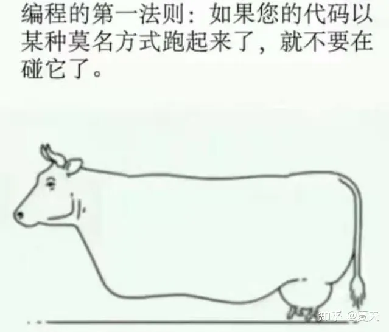
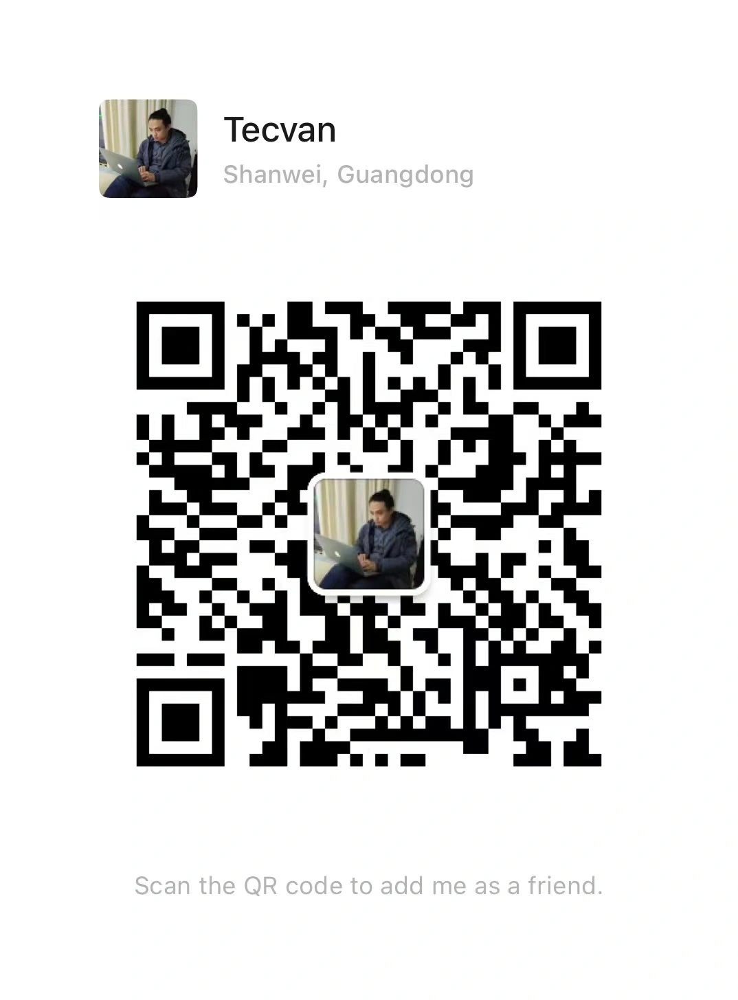

# 🦀🦀🦀 我的前端职业成长之路

大家好，我是 **范文杰**，一个前端从业者，最近刚写完我的第一本小册《[Webpack 核心原理与实践应用](https://juejin.cn/book/7115598540721618944)》，这对我是一个不小的职业突破，所以不能免俗地想做个总结，分享我这九年工作的成长经历，以及我对前端这个职业的思考与成长建议，希望能帮到哪些还在路上的朋友。

## 🦖 起源

我的职业起点算不上高，6 线海边小镇出身，不知名二本院校毕业，没背景没人脉，所幸在我毕业那会\(13 年\)就业市场相对还比较宽松，加上大二开始就有意识参加学校各种计算机实验室，提前积累了一些项目实战经验，所以最开始找工作时还算顺利。

> 图注：我的家乡，广东汕尾红海湾

## 🙇 一家创业公司

> **2013 年：攻克若干技术点，从一个懵懵懂懂的学生蜕变成能胜任一般工作的打工人**

我的第一份工作是在一家人数不超过 10 个的超迷你企业，前端就倆人，规范、技术沉淀啥的自然都是空缺的，也一直没人带，但这是我第一次正儿八经能每月拿到固定收入，有稳定的生活与工作节奏，对小镇青年来说并不觉得有啥不妥，整体心态比较平稳，加上我自己本身就爱折腾，总愿意在实现基本功能之余看看有没有更好的工具、方案。

当时国内的才刚开始讨论 **前后端分离** 的概念，主流技术栈还是 jQuery，工程化水平还很低，我是看了不少资料之后，将公司技术栈从 jQuery + JSP 逐渐迁移到 jQuery + Grunt + Require.js + Less + ECharts + Bootstrap + 各种当时眼花缭乱的技术，到现在我还清晰地记得，当时在项目中逐步引入这些工具，并顺利调通落地那一刻的喜悦与兴奋。

这一阶段对我来说，算不上有多深的技术积累，但至少给了我一个相对自由宽松的环境，能让我大胆实践各种技术方面的想法，也让我养成了遇事无解靠自己\(Ծ‸Ծ\)，主动思考、主动引入新的方式方法解决老旧问题的习惯，可以说是在不断攻克一个个单独的技术点，逐渐 **从一个懵懵懂懂的学生蜕变成能胜任一般工作的打工人**，虽然当时做的很多技术判断并不一定准确，但对我个人而言算是在不断尝试，不断突破，收获很多。

## 🤯 另一家创业公司

> **2015 年：从初阶工程师到中高阶**

后来几经辗转，在毕业两年那会\(15年\)去了另外一家初具规模\(50人\)的创业公司，当时是另一个合作了比较久也比较资深的服务端同学对我青睐有加，推荐我当了前端主管，虽然刚进去时这个所谓的前端团队还比较小 —— 加上我就一个人🙂。

进去之后，很多时间花在招聘、组建团队、新人培训、梳理开发规范、梳理合作流程等事务性工作上，留给自己写代码\(其实至今我都没有放弃写代码\)的时间比较少，当时完全是赶鸭子上架😖，管理方式以及对事物、行业、技术的认知都非常不成熟，做过一些荒唐事，印象很深的是当时因为招聘进度不理想，写了篇文章《[前端，我为什么不要你](https://www.cnblogs.com/vans/p/4550356.html)》发牢骚😭，文章内容真实但很不着调，当时被喷得直接关了账号不敢再去看评论了。

> 考古文：《[前端，为什么不要你](https://www.cnblogs.com/vans/p/4550356.html)》，轻喷，当时很不成熟。

刚进去那会，公司几个主要应用都是找了一群学生基于 jQuery + PHP 写的，代码量很大又非常混乱，性能差 Bug 多，文档奇缺，几乎命中了一个软件项目能想到的所有糟糕特点，基本上是没法继续往下写了🤬。

所以虽然人力有限，我需要做的第一件事情就是重新设计一套更健壮、可维护迭代、协作效率更高的前端架构与开发工作流，这意外地沉淀了一些在当时看起来挺酷的技术栈，包括：RequireJS、Sass、Glup、Browserify，以及 Angular\@1.x。这些技术点在当时都算比较新颖，中文资料很少，所以我在自己学完之后，还得花许多时间做团队培训、梳理实战案例、剖析技术原理等。

其次，在组建团队过程中我逐渐意识到，约定不如规范，规范不如工具，所以在常规培训之余，还围绕 Angular 做了一些脚手架工具、插件，制定了 ESLint 开发规则，引入自动化测试工具等，企图尽可能把繁琐的事情都交给“工具”实现。

最后结果还算比较幸运，磕磕绊绊地总算是建了一支十个人左右的团队，在预期时间内把事情做完，这些花费大量心血的技术设计、规则规范、工具也都能顺利落地，即便在后面我离开后还一直被沿用，直到这家公司也宣布破产。

这个阶段让我开始有一丢丢 **开窍** 的感觉，让我走出熟悉的领域主动接触更大更宽广的技术面；初步学会从管理者视角去 Review 技术应用于技术本身的价值；重视团队协作、规范、工具、效率，也初步习得一些 MVVM、OOP/FP、工程化之类的思维，算是 **从一个初阶工程师逐步在往中高阶迈进**。

## 👾 腾讯

> **2016 年：虚无**

再往后， 16 年很幸运进了我职业生涯第一个真正意义上的大厂：腾讯，这个过程并不顺利，前前后后面了差不多有 10 个不同岗位，才终于勉强被相中了\(🥴\)。腾讯是我那时候最大的职业目标，当时认为这是对自身能力的一种比较高的市场认可，能达成这个目标的话，后面职业生涯应该会顺利许多。

腾讯是我待过最舒服的公司了，工作压力不大，幸福感非常强，但慢慢地真就变成了拧螺丝钉的角色，变得堕怠，这里面有很多因素，但主因还是我自己的性格并不适合这种四平八稳的工作节奏，不知不觉就习惯了套用团队里面各种现成、成熟的方式方法解决业务问题，效率是高，但对个人没有太大的技术成长空间与思考余地。

所以，这个阶段在工作上陷入了相同技能反复使用的境地，技术增长基本为 0，除了业余时间自己捡起来学习的各种计算机基础知识之外，基本没有输入，这种情况让我感觉非常焦虑，自然是呆不长久了，短短 2 年就选择撤离了。

> 防喷：不是腾讯不好，只是它不适合当时的我。

## 🕵️ 再次进入创业公司

> **2018 年：从单个面的技术应用者到立体的系统设计者**

从腾讯出来之后，选择面还挺广，经过一番对比最终去了一家小而美的人工智能创业公司。这家公司加总不到 100 号人，全职前端也才 4 个，但却是软银在中国投资的人工智能公司，国内国外获奖无数，创始人、算法负责人、技术负责人背景都很强，在我看来前景无限又有足够大的发挥空间，完美契合我对“小而美”的所有想象。

这家公司也确实符合我大部分预期，Leader 给予了足够的信任与授权，让我放手大干一番：

- 刚进去 3 个月就吭哧吭哧把所有业务系统全部重构了一遍；
- 在原有技术栈\(Vue\)基础上引入了许多新工具，重新定义规范、最佳实践、工程化方法论；
- 优化核心系统架构，并总结一系列较简易的开发模式\(屠龙勇士终成恶龙？\)让新同学能够低成本、高效率参与到开发；
- 识别业务同学的痛点难点，业余时间捣鼓了不少提效工具，包括：JSON 数据可视化、JSON 数据流式处理框架、基于 MXGraph 的流程图编辑器等；
- 等等。

如果说前面都在 **厚积** 的话，这个阶段是真让我狠狠 **薄发** 了一番，并且很幸运的一直没出过啥差错，慢慢的公司甚至让我带着服务端、数据、算法、产品等不同职能的同学一起做更多事情，走出前端职能角色站在更高更全面视角审视业务需求、设计应用系统、组织开发节奏等，**从单个面的技术应用者进化为更立体更成熟的系统设计者**，能串起不同职能的同学一起，完完整整地做好一个稍具复杂度的业务方向。

## 🥷 字节

> **2020 年，未来可期**

接着，就来到我现在所在的公司 —— 字节跳动，面试过程其实不太顺利，四轮技术一轮 HR，一路有惊无险侥幸过关，进来之后整体感受还是很符合预期的：

1. 文化自由，不讲究 Title，我接触到的绝大多数研发岗位也都没有所谓政治考量，基本都不看背景看能力；
2. 只要你愿意，有一堆值得你做的技术 or 流程优化、重构，甚至创造，没人会阻拦你！
3. 如果你能把事情的价值说清楚，那即使你只是一个一线同学，都能撬动不少资源帮你做这件事情；
4. 公司内也有许多接触社区的机会，我也是在了解到这些渠道之后才慢慢开始写博客，写小册，去青训营当讲师，等等；
5. 公司内有太多技术能力非常强的人了，数不胜数，我甚至遇到过一个让我很是自愧不如的实习生，实习生\(bn\)！！！！
6. 等等。

在这里我做过不少有意思的事情，承蒙身边同学关照，技术、管理、软素质、行业认知各个方面都有所长进。并且字节的诸多文化观也逐渐影响到我的业余生活，让我在工作之余开始做一些一直想做但没做好的事情，例如最近刚写完的 [**Webpack5 核心原理与应用实践**](https://juejin.cn/book/7115598540721618944) 小册：

> 小册地址：<https://juejin.cn/book/7115598540721618944>

虽然这对很多 **大佬** 来说并不算什么难事，但于我已经是一个非常大的职业里程碑，我几乎把 Webpack 的所有功能都调试了一遍，所有代码都看了一遍，花了大半年时间，跟小编重复打磨了许多次，才攒出来这么一本书，我个人对这本书的内容质量还是比较有信心的，希望能帮到需要的同学。

未来我会在业余时间继续做更多的事情，包括写文章、做开源、吃海鲜，偶尔帮一些有缘分的同学做做职业辅导、职业规划，等等，希望能见到一个更大的世界。

## ☄️ 小结

回顾这么些年，从最开始的不知名创业小公司，到现在进了还算前列的字节跳动并且能输出一些社区作品，虽然放在行业大背景看啥都不是，但对我这种小镇青年来说已经非常不错，虽然运气成分居多，但也有一些人为的、刻意的努力在里面：

- 最开始懵懵懂懂一知半解，死死抓住一个机会努力学习特定技能，满足 —— 甚至超越工作需求；
- 由点到面，深挖某个有前景的技术体系，将之转化为技术设计应用到业务中，并且将之沉淀为可复用的经验，帮助别人成长；
- 厚积薄发，用自己的技能与经验，创造出适合业务场景、团队背景的技术方案与工具，跳出角色职能帮助业务拿结果；
- 向外拓展，在行业大背景下寻求更多成功机会。

虽然有点马后炮，但其实这也是适合大多数普通人的职业发展路径：**胜任 => 精进 => 创造 => 影响力**。在今年这种寒冬背景下，我觉得我们在焦虑之余更需要静下心来思考怎么走好下一步，让自己尽快走入职业安全区，希望这条路径能帮到你，共勉！

## 🦅 一些浅薄的观点

这么捋下来，我已经工作了差不多十个年头，前前后后大中小型公司都待过，算是比许多小同学虚长几岁，阅历丰富一丢丢了，所以有一些关于前端职业与个人成长的观点挺想分享一下的，抛砖引玉吧。

**Q: 前端天花板很低？🤔**

有不少人觉得前端天花板很多，这个观点我是不敢苟同的，以我为例，虽然已经工作了 10 年，但还有非常多不懂的东西，离所谓“天花板”还十万八千里呢。

其次，前端领域虽然比较少出现服务端那种高并发计算场景，但也有不少复杂的事情可以做，比如：工程化、编辑器、可视化、 IDE 等等，这些方向每一个拆解下去又会有许多复杂的技术点，都值得长时间的投入、学习，也都能为你带来长远的职业发展空间。

所以，可能哪些一直鼓吹“前端天花板很低”的人，要么是天才，要么只是还处在 **愚昧之巅** 罢了。

**Q: 遭遇职业迷茫，觉得自己潜力低，成长性差，怎么办？🤔**

最近一年各种机缘巧合，跟许多不同年龄层的同学有过接触，我发现大多数人其实并没有明确、具体的职业成长规划，没有想清楚自己当下该做些什么，未来该往那走，整体过的比较迷茫也比较焦虑。

归根结底，我认为这些同学不是不想，而是实在不能或者不会，这里面有些是工作 **太忙** 了，消耗了大部分精力，无暇思考；有些是对行业缺乏必要 **认知**，不懂得结合自身情况做出合适的判断与选择；还有很多是严重 **缺乏自信**，过度妄自菲薄踌躇不前，等等。

咋说呢，这个问题没有标准答案，而且展开来值得另外写一篇长长的文章，所以这里我只想分享一个简单的思维模式：

1. 设定一个具体、时间粒度合适的目标\(参考 Star 原则\)，例如在 3 年内到达 xx 职级；
2. 倒推回来，为了达成这个目标你需要具备哪些方面的能力\(不是技能\)，做出哪些成果？包括技术上的、软素质上的、管理上的，画成一个思维导图；
3. 再倒推回来，就着这些能力与成果设定若干时间粒度更小\(双月\)的里程碑，定期 Review、纠偏。

每一个步骤都并不容易，特别是，怎么锻炼能力？有两个思路，一是找一份完全匹配你能力水平与成长目标的工作，这需要天时地利人和，并不容易；二是在日常业务工作之外**主动**学习、**主动**争取机会、**主动**创造场景，**主动**去做一些别人并没有要求你必须做，但你又觉得正确的事。

**Q: 我当下做什么，收益最大？🤔**

讲真，我哪知道。。。不过有一个比较通用的思路：**构建自己的核心竞争力**！这句话是几年我面试微信被拒时，面试官送给我的话，当时有种很强烈的醍醐灌顶的感觉，在此之后我才算是有耐心去做一些长久的事情。

其实有很多同学 —— 特别是哪些刚毕业没多久的，都会觉得技术栈全一点，能力模型立体一点，会更有市场，所以啥都会去学一下，雨露均沾。但事实恰恰相反，优秀团队对人才的画像基本上都首先是深度，在具备足够深度的基础上才会考虑广度，这也是为什么现在面试动辄追问实现原理的原因。

所以，如果你实在不知道自己该往那个方向努力，实在憋不出所谓的职业规划，可以考虑先找到自己最最擅长的技术点，然后花足够多的时间扎扎实实学深学透，

> 关于这方面，之前有位同学的文章已经总结的比较详细了：<https://juejin.cn/post/7139158428785737758> 。

Blabla\~\~，太多了，就不往下写了🤐🤐🤐，有兴趣跟我继续探讨，或者处于职业迷茫期的同学也可以 **加我微信**聊聊。

## 🦀 成长建议

最后分享一些，我个人觉得还比较有用的建议：

1. 🦑 保持职业敏感度，不要轻易放过你遇到的大大小小问题，持续折腾持续迭代，做一个有技术追求的人；
2. 🐠 做正确的事 —— 不是难的事，也不是简单的事，是正确的事！！！
3. 🦈 当断则断，假若工作真的无法给你带来成长，或者给你造成过大的内耗，就趁早做决定吧；
4. 🦞 深度远比广度重要的多，你应该优先发展自己的**核心竞争力**，而不是看到啥新奇的东西都往上凑；
5. 🦐 走出去，主动了解这个行业，多找老江湖聊聊，了解什么阶段的人需要达到什么程度的技术水平，个人达到什么状态之后职业安全性会更强，等等；
6. 🐙 人在事前，保持开放，多交点朋友；
7. 🐡 坚持不一定都会达成预期目标，但如果你没有其它更好的选择，那就沉下心来先做好一件事吧；
8. 🐟 最好的学习方法是自学，不过最好旁边偶尔能有人点拨一两句；
9. 🫕 注意身体，保持锻炼💪，保持乐观🥳，时不时可以来一句：新年快乐🧨🧨🧨\~
10. 没了，主要是找不到合适的 emoji 了。
