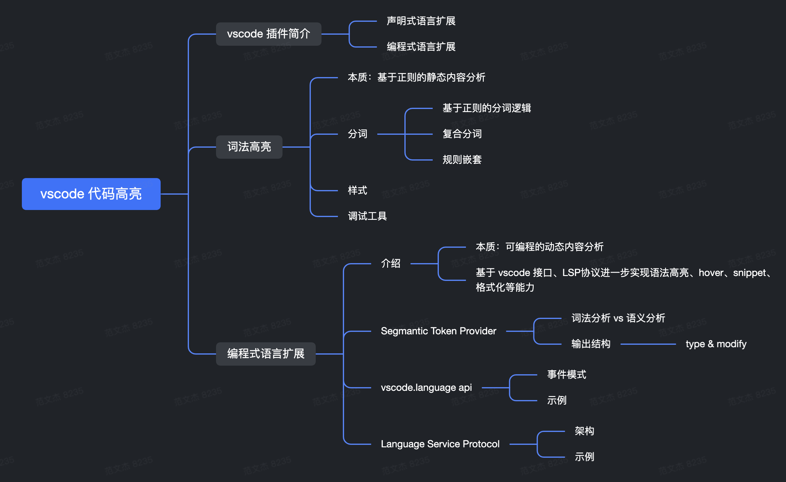
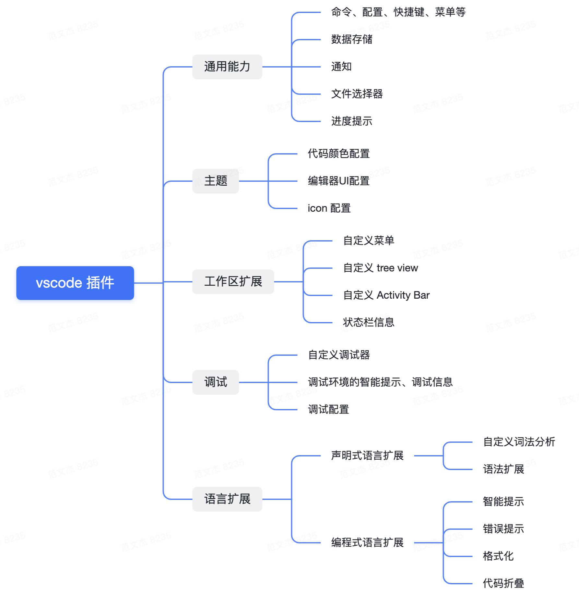
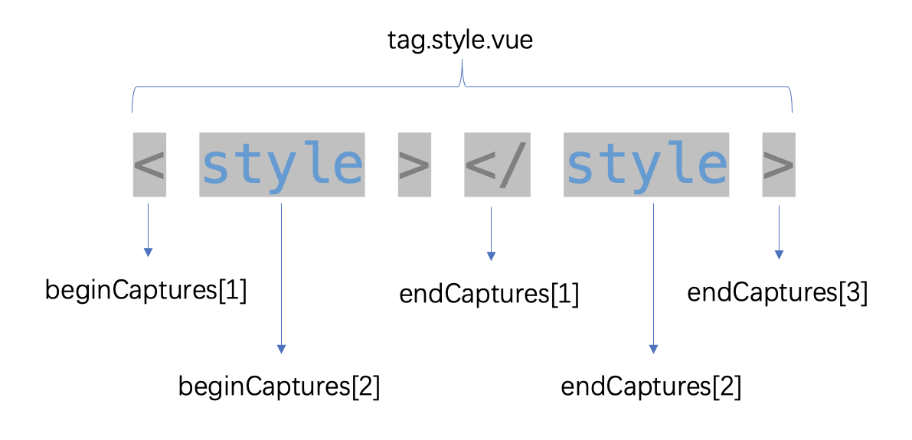
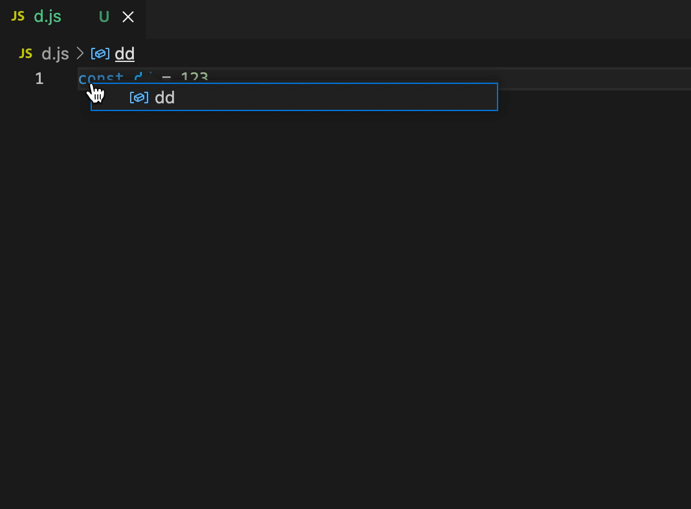
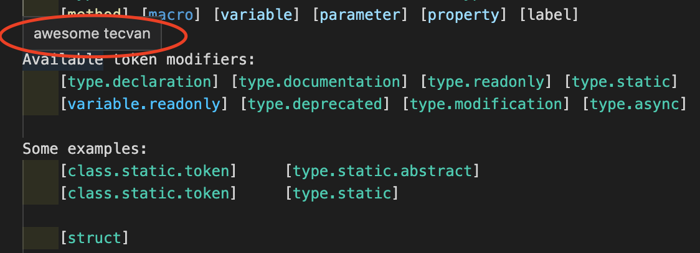
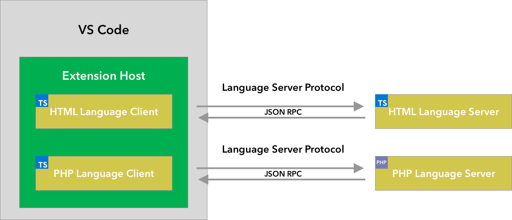

# 你不知道的 VSCode 代码高亮原理

> 全文5000字，解读 vscode 背后的代码高亮实现原理，欢迎点赞关注转发。

Vscode 的代码高亮、代码补齐、错误诊断、跳转定义等语言功能由两种扩展方案协同实现，包括：

- 基于词法分析技术，识别分词 token 并应用高亮样式
- 基于可编程语言特性接口，识别代码语义并应用高亮样式，此外还能实现错误诊断、智能提示、格式化等功能

两种方案的功能范畴逐级递增，相应地技术复杂度与实现成本也逐级升高，本文将概要介绍两种方案的工作过程与特点，各自完成什么工作，互相这么写作，并结合实际案例一步步揭开 vscode 代码高亮功能的实现原理：



## Vscode 插件基础

介绍 vscode 代码高亮原理之前，有必要先熟悉一下 vscode 的底层架构。与 Webpack 相似，vscode 本身只是实现了一套架子，架子内部的命令、样式、状态、调试等功能都以插件形式提供，vscode 对外提供了五种拓展能力：



其中，代码高亮功能由 **语言扩展** 类插件实现，根据实现方式又可以细分为：

- **声明式** ：以特定 JSON 结构声明一堆匹配词法的正则，无需编写逻辑代码即可添加如块级匹配、自动缩进、语法高亮等语言特性，vscode 内置的 extendsions/css、extendsions/html 等插件都是基于声明式接口实现的
- **编程式** ：vscode 运行过程中会监听用户行为，在特定行为发生后触发事件回调，编程式语言扩展需要监听这些事件，动态分析文本内容并按特定格式返回代码信息

声明式性能高，能力弱；编程式性能低，能力强。语言插件开发者通常可以混用，用声明式接口在最短时间内识别出词法 token，提供基本的语法高亮功能；之后用编程式接口动态分析内容，提供更高级特性比如错误诊断、智能提示等。

Vscode 中的声明式语言扩展基于 TextMate 词法分析引擎实现；编程式语言扩展则基于语义分析接口、`vscode.language.*` 接口、Language Server Protocol 协议三种方式实现，下面展开介绍每种技术方案的基本逻辑。

## 词法高亮

**词法分析\(Lexical Analysis\)** 是计算机学科中将字符序列转换为 **标记\(token\)** 序列的过程，而 **标记\(token\)** 是构成源代码的最小单位，词法分析技术在编译、IDE等领域有非常广泛的应用。

比如 vscode 的词法引擎分析出 token 序列后再根据 token 的类型应用高亮样式，这个过程可以简单划分为分词、样式应用两个步骤。

> 参考资料：
>
> - <https://macromates.com/manual/en/language\_grammars>
> - <https://code.visualstudio.com/api/language-extensions/syntax-highlight-guide>

### 分词

分词过程本质上将一长串代码递归地拆解为具有特定含义、分类的字符串片段，比如 `+-*/%` 等操作符；`var/const` 等关键字；`1234` 或 `"tecvan"` 类型的常量值等，简单说就是从一段文本中识别出，什么地方有一个什么词。

Vscode 的词法分析基于 [TextMate](https://macromates.com/) 引擎实现，功能比较复杂，可以简单划分为三个方面：基于正则的分词、复合分词规则、嵌套分词规则。

#### 基本规则

Vscode 底层的 [TextMate](https://macromates.com/) 引擎基于 [正则](https://macromates.com/manual/en/regular_expressions) 匹配实现分词功能，运行时逐行扫描文本内容，用预定义的 [rule](https://macromates.com/manual/en/language_grammars#language_rules) 集合测试文本行中是否包含匹配特定正则的内容，例如对于下面的规则配置：

``` javascript
{
    "patterns": [
        {
            "name": "keyword.control",
            "match": "\b(if|while|for|return)\b"
        }
    ]
}
```

示例中，`patterns` 用于定义规则集合， `match` 属性定于用于匹配 token 的正则，`name` 属性声明该 token 的分类\(scope\)，TextMate 分词过程遇到匹配 `match` 正则的内容时，会将其看作单独 token 处理并分类为 `name` 声明的 `keyword.control` 类型。

上述示例会将 `if/while/for/return` 关键词识别为 `keyword.control` 类型，但无法识别其它关键字：


在 TextMate 语境中，scope 是一种 `.` 分割的层级结构，例如 `keyword` 与 `keyword.control` 形成父子层级，这种层级结构在样式处理逻辑中能实现一种类似 css 选择器的匹配，后面会讲到细节。

#### 复合分词

上述示例配置对象在 TextMate 语境下被称作 Language Rule，除了 `match` 用于匹配单行内容，还可以使用 `begin + end` 属性对匹配更复杂的跨行场景。从 `begin` 到 `end` 所识别到的范围内，都认为是 `name` 类型的 token，比如在 [vuejs/vetur](https://github.com/vuejs/vetur) 插件的 `syntaxes/vue.tmLanguage.json` 文件中有这么一段配置：

``` javascript
{
    "name": "Vue",
    "scopeName": "source.vue",
    "patterns": [
        {
          "begin": "(<)(style)(?![^/>]*/>\\s*$)",
          // 虚构字段，方便解释
          "name": "tag.style.vue",
          "beginCaptures": {
            "1": {
              "name": "punctuation.definition.tag.begin.html"
            },
            "2": {
              "name": "entity.name.tag.style.html"
            }
          },
          "end": "(</)(style)(>)",
          "endCaptures": {
            "1": {
              "name": "punctuation.definition.tag.begin.html"
            },
            "2": {
              "name": "entity.name.tag.style.html"
            },
            "3": {
              "name": "punctuation.definition.tag.end.html"
            }
          }
        }
    ]
}
```

配置中，`begin` 用于匹配 `<style>` 语句，`end` 用于匹配 `</style>` 语句，且 `<style></style>` 整个语句被赋予 scope 为 `tag.style.vue` 。此外，语句中字符被 `beginCaptures` 、`endCaptures` 属性分配成不同的 scope 类型：



这里从 `begin` 到 `beginCaptures` ，从 `end` 到 `endCaptures` 形成了某种程度的复合结构，从而实现一次匹配多行内容。

#### 规则嵌套

在上述 `begin + end` 基础上，TextMate 还支持以子 `patterns` 方式定义嵌套的语言规则，例如：

``` json
{
    "name": "lng",
    "patterns": [
        {
            "begin": "^lng`",
            "end": "`",
            "name": "tecvan.lng.outline",
            "patterns": [
                {
                    "match": "tec",
                    "name": "tecvan.lng.prefix"
                },
                {
                    "match": "van",
                    "name": "tecvan.lng.name"
                }
            ]
        }
    ],
    "scopeName": "tecvan"
}
```

配置识别 ``lng` `` 到 `` ` `` 之间的字符串，并分类为 `tecvan.lng.outline` 。之后，递归处理两者之间的内容并按照子 `patterns` 规则匹配出更具体的 token ，例如对于：

```
lng`awesome tecvan`
```

可识别出分词：

- ``lng`awesome tecvan` `` ，scope 为 `tecvan.lng.outline`
- `tec` ，scope 为 `tecvan.lng.prefix`
- `van` ，scope 为 `tecvan.lng.name`

TextMate 还支持语言级别的嵌套，例如：

``` json
{
    "name": "lng",
    "patterns": [
        {
            "begin": "^lng`",
            "end": "`",
            "name": "tecvan.lng.outline",
            "contentName": "source.js"
        }
    ],
    "scopeName": "tecvan"
}
```

基于上述配置， ``lng` `` 到 `` ` `` 之间的内容都会识别为 `contentName` 指定的 `source.js` 语句。

### 样式

词法高亮本质上就是先按上述规则将原始文本拆解成多个具类的 token 序列，之后按照 token 的类型适配不同的样式。TextMate 在分词基础上提供了一套按照 token 类型字段 scope 配置样式的功能结构，例如：

``` json
{
    "tokenColors": [
        {
            "scope": "tecvan",
            "settings": {
                "foreground": "#eee"
            }
        },
        {
            "scope": "tecvan.lng.prefix",
            "settings": {
                "foreground": "#F44747"
            }
        },
        {
            "scope": "tecvan.lng.name",
            "settings": {
                "foreground": "#007acc",
            }
        }
    ]
}
```

示例中，`scope` 属性支持一种被称作 **Scope Selectors** 的匹配模式，这种模式与 css 选择器类似，支持：

- 元素选择，例如 `scope = tecvan.lng.prefix` 能够匹配 `tecvan.lng.prefix` 类型的token；特别的 `scope = tecvan` 能够匹配 `tecvan.lng` 、`tecvan.lng.prefix` 等子类型的 token
- 后代选择，例如 `scope = text.html source.js` 用于匹配 html 文档中的 JavaScript 代码
- 分组选择，例如 `scope = string, comment` 用于匹配字符串或备注

插件开发者可以自定义 scope 也可以选择复用 TextMate 内置的许多 scope ，包括 comment、constant、entity、invalid、keyword 等，完整列表请查阅 [官网](https://macromates.com/manual/en/language_grammars#naming_conventions)。

`settings` 属性则用于设置该 token 的表现样式，支持foreground、background、bold、italic、underline 等样式属性。

### 实例解析

看完原理我们来拆解一个实际案例： <https://github.com/mrmlnc/vscode-json5> ，[json5](https://json5.org/) 是 JSON 扩展协议，旨在使人类更易于手动编写和维护，支持备注、单引号、十六进制数字等特性，这些拓展特性需要使用 vscode-json5 插件实现高亮效果：


上图中，左边是没有启动 vscode-json5 的效果，右边是启动后的效果。

vscode-json5 插件源码很简单，两个关键点：

- 在 `package.json` 文件中声明插件的 `contributes` 属性，可以理解为插件的入口：

``` json
  "contributes": {
    // 语言配置
    "languages": [{
      "id": "json5",
      "aliases": ["JSON5", "json5"],
      "extensions": [".json5"],
      "configuration": "./json5.configuration.json"
    }],
    // 语法配置
    "grammars": [{
      "language": "json5",
      "scopeName": "source.json5",
      "path": "./syntaxes/json5.json"
    }]
  }
```

- 在语法配置文件 `./syntaxes/json5.json` 中按照 TextMate 的要求定义 Language Rule：

``` json
{
    "scopeName": "source.json5",
    "fileTypes": ["json5"],
    "name": "JSON5",
    "patterns": [
        { "include": "#array" },
        { "include": "#constant" }
        // ...
    ],
    "repository": {
        "array": {
            "begin": "\\[",
            "beginCaptures": {
                "0": { "name": "punctuation.definition.array.begin.json5" }
            },
            "end": "\\]",
            "endCaptures": {
                "0": { "name": "punctuation.definition.array.end.json5" }
            },
            "name": "meta.structure.array.json5"
            // ...
        },
        "constant": {
            "match": "\\b(?:true|false|null|Infinity|NaN)\\b",
            "name": "constant.language.json5"
        } 
        // ...
    }
}
```

OK，结束了，没了，就是这么简单，之后 vscode 就可以根据这份配置适配 json5 的语法高亮规则。

### 调试工具

Vscode 内置了一套 scope inspect 工具，用于调试 TextMate 检测出的 token、scope 信息，使用时只需要将编辑器光标 focus 到特定 token 上，快捷键 `ctrl + shift + p` 打开 vscode 命令面板后输出 `Developer: Inspect Editor Tokens and Scopes` 命令并回车：



命令运行后就可以看到分词 token 的语言、scope、样式等信息。

## 编程式语言扩展

词法分析引擎 TextMate 本质上是一种基于正则的静态词法分析器，优点是接入方式标准化，成本低且运行效率较高，缺点是静态代码分析很难实现某些上下文相关的 IDE 功能，例如对于下面的代码：


注意代码第一行函数参数 `languageModes` 与第二行函数体内的 `languageModes` 是同一实体但是没有实现相同的样式，视觉上没有形成联动。

为此，vscode 在 TextMate 引擎之外提供了三种更强大也更复杂的语言特性扩展机制：

- 使用 `DocumentSemanticTokensProvider` 实现可编程的语义分析
- 使用 `vscode.languages.*` 下的接口监听各类编程行为事件，在特定时间节点实现语义分析
- 根据 [Language Server Protocol](https://microsoft.github.io/language-server-protocol/) 协议实现一套完备的语言特性分析服务器

相比于上面介绍的声明式的词法高亮，语言特性接口更灵活，能够实现诸如错误诊断、候选词、智能提示、定义跳转等高级功能。

> 参考资料：
>
> - <https://code.visualstudio.com/api/language-extensions/semantic-highlight-guide>
> - <https://code.visualstudio.com/api/language-extensions/programmatic-language-features>
> - <https://code.visualstudio.com/api/language-extensions/language-server-extension-guide>

### DocumentSemanticTokensProvider 分词

#### 简介

**Sematic Tokens Provider** 是 vscode 内置的一种对象协议，它需要自行扫描代码文件内容，然后以整数数组形式返回语义 token 序列，告诉 vscode 在文件的哪一行、那一列、多长的区间内是一个什么类型的 token。

注意区分一下，TextMate 中的扫描是引擎驱动的，逐行匹配正则，而 **Sematic Tokens Provider** 场景下扫描规则、匹配规则都交由插件开发者自行实现，灵活性增强但相对的开发成本也会更高。

实现上，**Sematic Tokens Provider** 以 `vscode.DocumentSemanticTokensProvider` 接口定义，开发者可以按需实现两个方法：

- `provideDocumentSemanticTokens` ：全量分析代码文件语义
- `provideDocumentSemanticTokensEdits` ：增量分析正在编辑模块的语义

我们来看个完整的示例：

``` javascript
import * as vscode from 'vscode';

const tokenTypes = ['class', 'interface', 'enum', 'function', 'variable'];
const tokenModifiers = ['declaration', 'documentation'];
const legend = new vscode.SemanticTokensLegend(tokenTypes, tokenModifiers);

const provider: vscode.DocumentSemanticTokensProvider = {
  provideDocumentSemanticTokens(
    document: vscode.TextDocument
  ): vscode.ProviderResult<vscode.SemanticTokens> {
    const tokensBuilder = new vscode.SemanticTokensBuilder(legend);
    tokensBuilder.push(      
      new vscode.Range(new vscode.Position(0, 3), new vscode.Position(0, 8)),
      tokenTypes[0],
      [tokenModifiers[0]]
    );
    return tokensBuilder.build();
  }
};

const selector = { language: 'javascript', scheme: 'file' };

vscode.languages.registerDocumentSemanticTokensProvider(selector, provider, legend);
```

相信大多数读者对这段代码都会觉得陌生，我想了很久，觉得还是从函数输出的角度开始讲起比较容易理解，也就是上例代码第 17 行 `tokensBuilder.build()`。

#### 输出结构

`provideDocumentSemanticTokens` 函数要求返回一个整数数组，数组项按 5 位为一组分别表示：

- 第 `5 * i` 位，token 所在行相对于上一个 token 的偏移
- 第 `5 * i + 1` 位，token 所在列相对于上一个 token 的偏移
- 第 `5 * i + 2` 位，token 长度
- 第 `5 * i + 3` 位，token 的 type 值
- 第 `5 * i + 4` 位，token 的 modifier 值

我们需要理解这是一个位置强相关的整数数组，数组中每 5 个项描述一个 token 的位置、类型。token 位置由所在行、列、长度三个数字组成，而为了压缩数据的大小 vscode 有意设计成相对位移的形式，例如对于这样的代码：

``` js
const name as
```

假如只是简单地按空格分割，那么这里可以解析出三个 token：`const` 、 `name` 、`as` ，对应的描述数组为：

``` javascript
[
// 对应第一个 token：const
0, 0, 5, x, x,
// 对应第二个 token： name
0, 6, 4, x, x,
// 第三个 token：as
0, 5, 2, x, x
]
```

注意这里是以相对前一个 token 位置的形式描述的，比如 `as` 字符对应的 5 个数字的语义为：相对前一个 token 偏移 0 行、5 列，长度为 2 ，类型为 xx。

剩下的第 `5 * i + 3` 位与第 `5 * i + 4` 位分别描述 token 的 type 与 modifier，其中 type 指示 token 的类型，例如 comment、class、function、namespace 等等；modifier 是类型基础上的修饰器，可以近似理解为子类型，比如对于 class 有可能是 abstract 的，也有可能是从标准库导出 defaultLibrary。

type、modifier 的具体数值需要开发者自行定义，例如上例中：

``` javascript
const tokenTypes = ['class', 'interface', 'enum', 'function', 'variable'];
const tokenModifiers = ['declaration', 'documentation'];
const legend = new vscode.SemanticTokensLegend(tokenTypes, tokenModifiers);

// ...

vscode.languages.registerDocumentSemanticTokensProvider(selector, provider, legend);
```

首先通过 `vscode. SemanticTokensLegend` 类构建 type、modifier 的内部表示 `legend` 对象，之后使用 `vscode.languages.registerDocumentSemanticTokensProvider` 接口与 provider 一起注册到 vscode 中。

#### 语义分析

上例中 `provider` 的主要作用就是遍历分析文件内容，返回符合上述规则的整数数组，vscode 对具体的分析方法并没有做限定，只是提供了用于构建 token 描述数组的工具 `SemanticTokensBuilder`，例如上例中：

``` javascript
const provider: vscode.DocumentSemanticTokensProvider = {
  provideDocumentSemanticTokens(
    document: vscode.TextDocument
  ): vscode.ProviderResult<vscode.SemanticTokens> {
    const tokensBuilder = new vscode.SemanticTokensBuilder(legend);
    tokensBuilder.push(      
      new vscode.Range(new vscode.Position(0, 3), new vscode.Position(0, 8)),
      tokenTypes[0],
      [tokenModifiers[0]]
    );
    return tokensBuilder.build();
  }
};
```

代码使用 SemanticTokensBuilder 接口构建并返回了一个 `[0, 3, 5, 0, 0]` 的数组，即第 0 行，第 3 列，长度为 5 的字符串，type =0，modifier = 0，运行效果：


除了这一段被识别出的 token 外，其它字符都被认为不可识别。

#### 小结

本质上，`DocumentSemanticTokensProvider` 只是提供了一套粗糙的 IOC 接口，开发者能做的事情比较有限，所以现在大多数插件都没有采用这种方案，读者理解即可，不必深究。

### Language API

#### 简介

相对而言，`vscode.languages.*` 系列 API 所提供的语言扩展能力可能更符合前端开发者的思维习惯。`vscode.languages.*` 托管了一系列用户交互行为的处理、归类逻辑，并以事件接口方式开放出来，插件开发者只需监听这些事件，根据参数推断语言特性，并按规则返回结果即可。

Vscode Language API 提供了很多事件接口，比如说：

- registerCompletionItemProvider： 提供代码补齐提示


- registerHoverProvider：光标停留在 token 上时触发


- registerSignatureHelpProvider：提供函数签名提示


完整的列表请查阅 [Programmatic Language Features](https://code.visualstudio.com/api/language-extensions/programmatic-language-features#show-hovers) 一文。

#### Hover 示例

Hover 功能实现分两步，首先需要在 `package.json` 中声明 hover 特性：

``` json
{
    ...
    "main": "out/extensions.js",
    "capabilities" : {
        "hoverProvider" : "true",
        ...
    }
}
```

之后，需要在 `activate` 函数中调用 `registerHoverProvider` 注册 hover 回调：

``` js
export function activate(ctx: vscode.ExtensionContext): void {
    ...
    vscode.languages.registerHoverProvider('language name', {
        provideHover(document, position, token) {
            return { contents: ['aweome tecvan'] };
        }
    });
    ...
}
```

运行结果：



其它特性功能的写法与此相似，感兴趣的同学建议到官网自行查阅。

### Language Server Protocol

#### 简介

上述基于语言扩展插件的代码高亮方法有一个相似的问题：难以在编辑器间复用，同一个语言，需要根据编辑器环境、语言重复编写功能相似的支持插件，那么对于 n 种语言，m 中编辑器，这里面的开发成本就是 `n * m`。

为了解决这个问题，微软提出了一种叫做 Language Server Protocol 的标准协议，语言功能插件与编辑器之间不再直接通讯，而是通过 LSP 做一层隔离：


增加 LSP 层带来两个好处：

- LSP 层的开发语言、环境等与具体 IDE 所提供的 host 环境脱耦
- 语言插件的核心功能只需要编写一次，就可以复用到支持 LSP 协议的 IDE 中

虽然 LSP 与上述 Language API 能力上几乎相同，但借助这两个优点大大提升了插件的开发效率，目前很多 vscode 语言类插件都已经迁移到 LSP 实现，包括 vetur、eslint、Python for VSCode 等知名插件。

Vscode 中的 LSP 架构包含两部分：

- Language Client: 一个标准 vscode 插件，实现与 vscode 环境的交互，例如 hover 事件首先会传递到 client，再由 client 传递到背后的 server
- Language Server: 语言特性的核心实现，通过 LSP 协议与 Language Client 通讯，注意 Server 实例会以单独进程方式运行

做个类比，LSP 就是经过架构优化的 Language API，原来由单个 provider 函数实现的功能拆解为 Client + Server 两端跨语言架构，Client 与 vscode 交互并实现请求转发；Server 执行代码分析动作，并提供高亮、补全、提示等功能，如下图：



#### 简单示例

LSP 稍微有一点点复杂，建议读者先拉下 vscode 官方示例对比学习：

``` sh
git clone https://github.com/microsoft/vscode-extension-samples.git
cd vscode-extension-samples/lsp-sample
yarn
yarn compile
code .
```

vscode-extension-samples/lsp-sample 的主要代码文件有：

``` sh
.
├── client // Language Client
│   ├── src
│   │   └── extension.ts // Language Client 入口文件
├── package.json 
└── server // Language Server
    └── src
        └── server.ts // Language Server 入口文件
```

样例代码中有几个关键点：

1. 在 `package.json` 中声明激活条件与插件入口
2. 编写入口文件 `client/src/extension.ts`，启动 LSP 服务
3. 编写 LSP 服务即 `server/src/server.ts` ，实现 LSP 协议

逻辑上，vscode 会在加载插件时根据 `package.json` 的配置判断激活条件，之后加载、运行插件入口，启动 LSP 服务器。插件启动后，后续用户在 vscode 的交互行为会以标准事件，如 hover、completion、signature help 等方式触发插件的 client ，client 再按照 LSP 协议转发到 server 层。

下面我们拆开看看三个模块的细节。

##### 入口配置

示例 vscode-extension-samples/lsp-sample 中的 `package.json` 有两个关键配置：

``` json
{
    "activationEvents": [
        "onLanguage:plaintext"
    ],
    "main": "./client/out/extension",
}
```

其中：

- `activationEvents`： 声明插件的激活条件，代码中的 `onLanguage:plaintext` 意为打开 txt 文本文件时激活
- `main`： 插件的入口文件

##### Client 样例

示例 vscode-extension-samples/lsp-sample 中的 Client 入口代码，关键部分如下：

``` js
export function activate(context: ExtensionContext) {
    // Server 配置信息
    const serverOptions: ServerOptions = {
        run: { 
            // Server 模块的入口文件
            module: context.asAbsolutePath(
                path.join('server', 'out', 'server.js')
            ), 
            // 通讯协议，支持 stdio、ipc、pipe、socket
            transport: TransportKind.ipc 
        },
    };

    // Client 配置
    const clientOptions: LanguageClientOptions = {
        // 与 packages.json 文件的 activationEvents 类似
        // 插件的激活条件
        documentSelector: [{ scheme: 'file', language: 'plaintext' }],
        // ...
    };

    // 使用 Server、Client 配置创建代理对象
    const client = new LanguageClient(
        'languageServerExample',
        'Language Server Example',
        serverOptions,
        clientOptions
    );

    client.start();
}
```

代码脉络很清晰，先是定义 Server、Client 配置对象，之后创建并启动了 `LanguageClient` 实例。从实例可以看到，Client 这一层可以做的很薄，在 Node 环境下大部分转发逻辑都被封装在 `LanguageClient` 类中，开发者无需关心细节。

##### Server 样例

示例 vscode-extension-samples/lsp-sample 中的 Server 代码实现了错误诊断、代码补全功能，作为学习样例来说稍显复杂，所以我只摘抄出错误诊断部分的代码：

``` ts
// Server 层所有通讯都使用 createConnection 创建的 connection 对象实现
const connection = createConnection(ProposedFeatures.all);

// 文档对象管理器，提供文档操作、监听接口
// 匹配 Client 激活规则的文档对象都会自动添加到 documents 对象中
const documents: TextDocuments<TextDocument> = new TextDocuments(TextDocument);

// 监听文档内容变更事件
documents.onDidChangeContent(change => {
    validateTextDocument(change.document);
});

// 校验
async function validateTextDocument(textDocument: TextDocument): Promise<void> {
    const text = textDocument.getText();
    // 匹配全大写的单词
    const pattern = /\b[A-Z]{2,}\b/g;
    let m: RegExpExecArray | null;

    // 这里判断，如果一个单词里面全都是大写字符，则报错
    const diagnostics: Diagnostic[] = [];
    while ((m = pattern.exec(text))) {
        const diagnostic: Diagnostic = {
            severity: DiagnosticSeverity.Warning,
            range: {
                start: textDocument.positionAt(m.index),
                end: textDocument.positionAt(m.index + m[0].length)
            },
            message: `${m[0]} is all uppercase.`,
            source: 'ex'
        };
        diagnostics.push(diagnostic);
    }

    // 发送错误诊断信息
    // vscode 会自动完成错误提示渲染
    connection.sendDiagnostics({ uri: textDocument.uri, diagnostics });
}
```

LSP Server 代码的主要流程：

- 调用 `createConnection` 建立与 vscode 主进程的通讯链路，后续所有的信息交互都基于 connection 对象实现。
- 创建 `documents` 对象，并根据需要监听文档事件如上例中的 `onDidChangeContent`
- 在事件回调中分析代码内容，根据语言规则返回错误诊断信息，例如示例中使用正则判断单词是否全部为大写字母，是的话使用 `connection.sendDiagnostics` 接口发送错误提示信息

运行效果：


##### 小结

通览样例代码，LSP 客户端服务器之间的通讯过程都已经封装在 `LanguageClient` 、`connection` 等对象中，插件开发者并不需要关心底层实现细节，也不需要深入理解 LSP 协议即可基于这些对象暴露的接口、事件等实现简单的代码高亮效果。

## 总结

Vscode 用插件方式提供了多种语言扩展接口，分声明式、编程式两类，在实际项目中通常会混合使用这两种技术，用基于 TextMate 的声明式接口迅速识别出代码中的词法；再用编程式接口如 LSP 补充提供诸如错误提示、代码补齐、跳转定义等高级功能。

这段时间看了不少开源 vscode 插件，其中 Vue 官方提供的 Vetur 插件学习是这方面的典型案例，学习价值极高，建议对这方面有兴趣的读者可以自行前往分析学习 vscode 语言扩展类插件的写法。

> 往期文章
>
> - [分享几个 Webpack 实用分析工具](https://mp.weixin.qq.com/s/A0udBhvNoA0o-kX1B0rt9A)
> - [\[建议收藏\] Webpack 4+ 优秀学习资料合集](https://zhuanlan.zhihu.com/p/372721645)
> - [\[万字总结\] 一文吃透 Webpack 核心原理](https://mp.weixin.qq.com/s/SbJNbSVzSPSKBe2YStn2Zw)
> - [\[源码解读\] Webpack 插件架构深度讲解](https://mp.weixin.qq.com/s/tXkGx6Ckt9ucT2o8tNM-8w)
> - [十分钟精进 Webpack：module.issuer 属性详解](https://mp.weixin.qq.com/s/QkXFOHNpL0PRQtCcWIaX-g)
> - [有点难的 webpack 知识点：Dependency Graph 深度解析](https://mp.weixin.qq.com/s/kr73Epnn6wAx9DH7KRVUaA)
> - [有点难的知识点： Webpack Chunk 分包规则详解](https://mp.weixin.qq.com/s/dFrRY_ntUwmIOXzs8TYcFQ)
> - [Webpack 原理系列六： 彻底理解 Webpack 运行时](https://mp.weixin.qq.com/s/nkBvbwpzeb0fzG02HXta8A)
> - [Webpack 原理系列七：如何编写loader](https://mp.weixin.qq.com/s/TPWcB4MfVrTgFtVxsShNFA)
