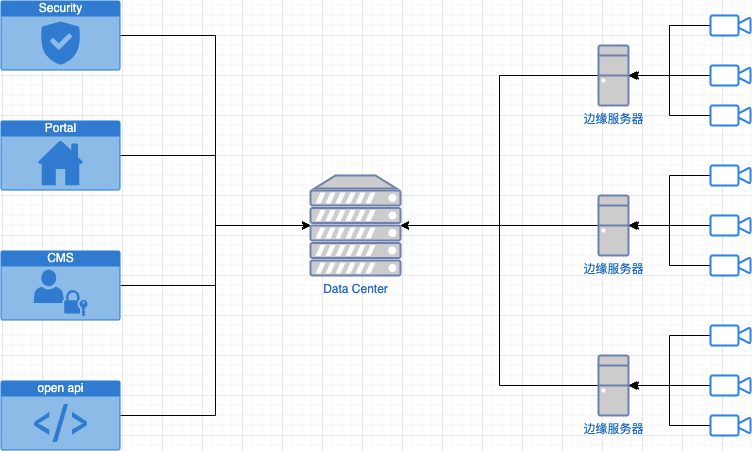

# HLS + ffmpeg 实现动态码流视频服务

## 一、简介

如下图，包含三部分，右边一列为边缘节点；中间一列代表数据中心；左边一列是项目为客户提供的一系列web管理工具：



具体来说在我们项目中有一堆边缘节点，每个节点上部署一台强大的GPU服务器及N个网络摄像头，服务器持续记录摄像头的高清码流，同时跑模型持续分析视频内容；边缘服务器与数据中心之间有一条网络链路，但**带宽非常小**，通常只作数据、控制命令下发用；数据中心部署了一系列web服务，为不同用户提供审阅系统运行情况及发布操作边缘节点命令的端口。

那么问题来了，终端用户通常并不关心摄像头录制到的视频，但**偶尔**需要抽检部分视频文件确定系统正在正常运行，出问题的时候算法团队需要导出原始高清视频作进一步分析，怎么破？提炼一下关键条件：

1. 数量众多的边缘节点，每天生成海量视频
2. 边缘节点到数据中心带宽有限
3. 需要提供不同清晰度的视频满足不同场景需要

最直观的方案是，将节点上的视频不断推送到数据中心，客户端直接访问存储在数据中心的视频数据，但这明显不符合场景要求，因为边缘节点到数据中心的带宽非常小，没办法支持高清视频文件的持续传输，而且抽检频率很低，全传回来了大多数也是用不上的。

第二种方案可以选择按需调度，即由客户明确发出抽调命令，指定时间范围、边缘节点列表、摄像头列表、清晰度，数据中心按需同步。这种方案有两个问题，一是延迟大，命令从客户端发出后，得等数据中心到边缘节点捞完数据，才能开始推送视频，开始响应；二是需要实现一套调度系统，实现一堆提高可用性的逻辑，比如监控带宽防止打满、实现断点续输、异步任务生命周期管理等。

第三种，也就是本文阐述的技术方案：使用 ffmpeg 动态调整视频码率、分辨率；使用 HLS 分段传输视频内容。

> 如果读者想到更多可能性，还请联系作者，我们可以讨论讨论。

## 二、核心技术

### 2.1 ffmpeg 简介

[ffmpeg](https://www.ffmpeg.org/) 是一个非常有名的高性能音视频处理工具，它可以轻松实现视频转码、分割、码率调整、分辨率调整、元数据解析、帧包解析等等，能满足大多数视频处理场景。网上已经有很多相关的讨论文章，本文就不赘述了。

> 提示：
>
> 贴几个有用的入门链接：
>
> 1. [ffmpeg 下载安装](https://www.ffmpeg.org/download.html)
> 1. [ffmpeg 镜像](https://hub.docker.com/r/jrottenberg/ffmpeg)，同时支持CPU、GPU版本
> 1. 阮一峰的 《[ffmpeg 视频处理入门教程](http://www.ruanyifeng.com/blog/2020/01/ffmpeg.html)》
> 1. [使用GPU硬件加速ffmpeg视频转码](https://www.jianshu.com/p/59da3d350488)

### 2.2 HLS 协议简介

[HLS](https://developer.apple.com/streaming/) 全称 Http Live Stream，是苹果推出的基于http的流媒体传输协议，原理是将一个大的，完整的视频文件拆解成多个小文件，每次只播放其中的一个小文件。选用HLS主要有如下的考量：

1. 协议底层使用http传输内容，这在大B环境下是个极大的利好，因为大多数企业内网防火墙有很严格的管控，唯独对80端口开放性较高
1. 支持按需加载，也就是说播到那就加载那一块小文件，播多少下载多少，不用download整个视频
1. 天然支持定点播放([seeking](https://developer.mozilla.org/en-US/docs/Web/Guide/Audio_and_video_delivery/buffering_seeking_time_ranges))

> 当时在做技术选型时也考虑过[DASH](https://en.wikipedia.org/wiki/Dynamic_Adaptive_Streaming_over_HTTP)，虽然DASH更有协议上的先进性，但当下覆盖度低，兼容性没HLS好，贸然选用怕是得给后面埋坑啊。

## 三、代码实现

核心代码其实特别简单，只需实现两个接口：

1. 获取索引文件接口，原理上使用 ffprobe 分析视频 I 帧分布时间点，生成 [m3u8](https://tools.ietf.org/html/rfc8216#page-9) 文件
1. 获取分片视频，原理上使用ffmpeg 分割、转码，再通过http输出切割后的视频文件

示例：

```javascript
import Router from 'koa-router';
import { exec, spawn } from 'child_process';
import config from 'config';
import path from 'path';

const route = new Router();
const execPromise = (...arg) =>
  new Promise((r, j) => {
    exec(...arg, (err, stdout) => {
      if (err) {
        j(err);
      } else {
        r(stdout);
      }
    });
  });

// 视频 m3u8 索引文件接口
route.get('/videos/:videoFile', async (ctx) => {
  const { videoFile } = ctx.params;
  const videoFilePath = path.join(config.get('VIDEO_ROOT_DIR'), videoFile);
  // 调用 ffprobe 分析视频 I 帧分布
  const cmdReadKeyframe = `ffprobe -v error -skip_frame nokey -select_streams v:0 -show_entries frame=pkt_pts_time -of csv=print_section=0 ${videoFilePath}`;
  const keyframes = (await execPromise(cmdReadKeyframe))
    .split('\n')
    .filter((d) => /^[\d\.]+$/.test(d))
    .map((d) => +d);

  // 调用 ffprobe 解析视频原信息
  const cmdReadMeta = `ffprobe -v quiet -print_format json -show_format -show_streams ${videoFilePath}`;
  const res = JSON.parse(await execPromise(cmdReadMeta));
  const {
    format: { duration }
  } = res;

  // 根据关键帧的时间分布和视频时长，生成 m3u8 文件
  const fragments = keyframes.map((k, i) => ({
    duration: i === keyframes.length - 1 ? duration - k : keyframes[i + 1] - k,
    start: k
  }));
  ctx.body =
     '#EXTM3U\n' +
      '#EXT-X-PLAYLIST-TYPE:VOD\n' +
      `#EXT-X-TARGETDURATION:${Math.max(...fragments.map((f) => f.duration))}\n` +
     `${fragments
        .map(
          (f) =>
            `#EXTINF:${f.duration},\n/hls_video/${videoFile}?start=${f.start}&duration=${f.duration}`
        )
        .join('\n')}\n` +
     '#EXT-X-ENDLIST';
  ctx.type = 'application/x-mpegURL';
});

// 读取视频片段
route.get('/hls_video/:videoFile', (ctx) => {
  const {
    params: { videoFile },
    query: { start, duration }
  } = ctx;
  const videoFilePath = path.join(config.get('VIDEO_ROOT_DIR'), videoFile);
  // ffmpeg 截取视频片段
  const cmd = `-ss ${start} -i ${videoFilePath} -t ${duration} -vcodec copy -acodec copy -b:v 200k -f hls -bsf h264_mp4toannexb -output_ts_offset ${start} -`;
  const { stdout } = spawn('ffmpeg', cmd.split(' '));

  ctx.type = 'video/MP2T';
  // 流式输出转码字节序
  ctx.body = stdout;
});

export default route;
```

下面讲解关键步骤。

### 3.1 根据 I 帧分割视频

HLS 的原理是将一个大的视频拆解为多个小视频按需传输，拆解策略的好坏直接影响视频还原度、转码效率、响应时间、缓存命中率等。可选的分割方案有：

1. 根据视频duration，均匀切割，好处是简单直观，但要么转换速度很慢导致响应时间高，要么还原度低，切出来的视频可能存在好几秒偏差(参考 《[FFmpeg 视频分割和合并](https://www.jianshu.com/p/cf1e61eb6fc8)》)
1. 根据视频 I 帧所在时间点进行切割，好处是还原度高，不容易掉帧；缺点是需要先用 [ffprobe](https://ffmpeg.org/ffprobe.html) 遍历视频中所有关键帧的位置，可能存在性能问题。

> 提示：
>
> 简单科普一下，经过压缩编码的视频主要包含了连续n个帧，其中有一种叫做 **I 帧(**Intra-coded picture)，特点是压缩率低但是内容完整，不需要其他帧辅助推算；除了I帧外常见的还有 **P‑帧** (Predicted picture) —— 向前搜索帧，**B‑frame** (Bidirectional predicted picture)  双向搜索帧，它们的压缩率高，但是需要依靠附近的I帧内容推算图像。
>
> 通常 ffmpeg 截取视频时大致上不是按 `-ss` 和 `-t` 指定的起始结束时间精确的裁剪，而是找到开始、结束时间点上最近的关键帧，截取两帧之间的数据，这会导致实际结果跟预期结果可能有好几秒的偏差。当然，为了精确裁剪，有一个变通的方法是将视频所有帧都先转成I帧再截取，但成本高，耗时大，无法满足实时响应需求。
>
> 所以本文才会选择根据I帧的时间点分割视频，虽然在遍历I帧时会有一些性能损失，但精确度跟总体响应速度都能满足需求。

分析I帧时间点的命令如下：

```bash
ffprobe -v error -skip_frame nokey -select_streams v:0 -show_entries frame=pkt_pts_time -of csv=print_section=0 ${videoFile}
```

关键参数：

1. `skip_frame`： 指定跳过那些帧，这里的值是 `nokey` 也就忽略了除I帧外的情况
1. `select_streams`： 选择下标为0的视频流
1. `frame`： 输出帧包的 `pkt_pts_time` 字段

执行命令，会得到类似下面的输出：

```bash
ffprobe -v error -skip_frame nokey -select_streams v:0 -show_entries frame=pkt_pts_time -of csv=print_section=0 xxx.mp4
0.000000
10.000000
20.000000
30.000000
40.000000
50.000000
60.000000
70.000000
80.000000
90.000000
100.000000
110.000000
120.000000
130.000000
140.000000
```

每一行即为关键帧在视频出现的时间点。

> 提示：
>
> 在生产环境千万要注意，有时候拿到的视频 I 帧间隔极短，比如笔者就遇到过用 [hiki SDK](https://www.hikvision.com/cn/download_61.html) 从网络摄像头或NVR设备取回的视频，平均 0.1s 一个关键帧，所以分割时如果帧间间隔很短，应该考虑将多个关键帧时间点合并成一个切片输出。

这一步需要调用 `child_process` 的 `exec` 函数运行 `ffprobe` 命令，并将结果格式化成 `number` 类型方便后续处理，核心代码：

```javascript
const cmdReadKeyframe = `ffprobe -v error -skip_frame nokey -select_streams v:0 -show_entries frame=pkt_pts_time -of csv=print_section=0 ${videoFilePath}`;
const keyframes = (await execPromise(cmdReadKeyframe))
  .split('\n')
  .filter((d) => /^[\d\.]+$/.test(d))
  .map((d) => +d);
```

### 3.2 生成M3U8索引文件

[M3U8 文件](https://developer.apple.com/documentation/http_live_streaming/example_playlists_for_http_live_streaming/event_playlist_construction)最主要的作用是提供了HLS视频分片的索引信息，播放器在处理HLS视频时首先访问这个索引文件，找出所有切片视频后再逐一按序播放。M3U8 常见格式如：

```bash
#EXTM3U
#EXT-X-PLAYLIST-TYPE:VOD
#EXT-X-TARGETDURATION:10
#EXTINF:10,
/hls_video/20200525221257_20200525222012.mp4?start=0&duration=10
#EXTINF:10,
/hls_video/20200525221257_20200525222012.mp4?start=10&duration=10
#EXTINF:10,
#EXTINF:5.319999999999993,
/hls_video/20200525221257_20200525222012.mp4?start=430&duration=5.319999999999993
#EXT-X-ENDLIST
```

简单介绍一下关键字段的含义：

1. `EXT-X-PLAYLIST-TYPE` ： 播放列表的类型，支持“EVENT”表示直播流，此时服务端可以不断往这个文件追加内容；“VOD”表示静态视频流 ，此时M3U8文件不会发生变更。在我们的场景中，选择使用“VOD”
1. `EXT-X-TARGETDURATION` ： 最大切片时长
1. `EXTINF` ：视频切片描述字段，需要指明切片地址、时长
1. `EXT-X-ENDLIST` ： 视频结束标志符，仅在 `EXT-X-PLAYLIST-TYPE=VOID` 时有效。

这一步需要根据上一步得到的关键帧时间点列表拼接出一个完整的 `m3u8` 文件，核心代码：

```javascript
// 计算分片大小
// 实际应用中注意判断，当时长小于某个阈值时应该合并多个节点
const fragments = keyframes.map((k, i) => ({
  duration: i === keyframes.length - 1 ? duration - k : keyframes[i + 1] - k,
  start: k
}));
ctx.body =
  // m3u8 头部信息
  '#EXTM3U\n' +
  '#EXT-X-PLAYLIST-TYPE:VOD\n' +
  `#EXT-X-TARGETDURATION:${Math.max(...fragments.map((f) => f.duration))}\n` +
  // 遍历分片，生成分片描述
  `${fragments
  .map(
  (f) =>
   // 这里简单起见，直接用参数记录分片开始、结束时间
    `#EXTINF:${f.duration},\n/hls_video/${videoFile}?start=${f.start}&duration=${f.duration}`
  )
  .join('\n')}\n` +
  // 结束标志符
  '#EXT-X-ENDLIST';
ctx.type = 'application/x-mpegURL';
```

### 3.3 生成视频片段

最后，需要根据分片的开始结束时间裁剪视频，毫无疑问这里还是用的 `ffempg` ，关键命令：

```bash
ffmpeg -ss 10 -i xxx.mp4 -t 10 -vcodec copy -acodec copy -b:v 200k -f hls -bsf h264_mp4toannexb -output_ts_offset 10 -
```

命令参数：

1. `-ss` ：指定开始时间
1. `-t` ：指定裁剪时长
1. `-vcodec copy -acodec copy` ： 指定音视频编码规则，可根据实际场景调整，注意转码时间通常较长，建议尽量复制原始音视频流
1. `-f hls` ： 指定视频封装格式为 `hls`
1. `-bsf h264_mp4toannexb` ：指定[字节流过滤器](https://ffmpeg.org/ffmpeg-bitstream-filters.html)，用于将原始 `mp4` 封装的字节数据转换为适合 `hls` 格式的字节数据
1. `-output_ts_offset 10` ： 这个很重要，指定分片开始时间，这个值必须严格按照分片在原视频所处的时间进行设定，否则播放器无法正常播放

> 提示：
>
> 整行命令的意思就是从 `ss` 开始截取 `-t` 长度的片段，音视频流直接copy，转封装为 hls 格式并对每个字节流使用 h264_mp4toannexb 过滤器，完事了再设定输出视频的开始时间。

对应的核心代码：

```javascript
const cmd = `-ss ${start} -i ${videoFilePath} -t ${duration} -vcodec copy -acodec copy -b:v 200k -f hls -bsf h264_mp4toannexb -output_ts_offset ${start} -`;
const { stdout } = spawn('ffmpeg', cmd.split(' '));

ctx.type = 'video/MP2T';
ctx.body = stdout;
```

> 提示：
>
> 这里还有一个小知识点，命令最后指定的输出是 `-` ，ffmpeg 遇到这种输出指令时会边转码边将字节流输出到后面的管道上，对应上例中将 `spawn` 命令的 `stdout` 流直接赋值给 `ctx.body` ，从而尽快向客户端发出响应。

## 四、性能优化

视频处理过程非常耗费时间，在本文介绍的这种实时处理场景更需要特别关注性能，可以从**尽量提升单个视频处理速度**   和 **尽量减少视频处理**两个方面入手，下面罗列一些有效的优化手段：

### 4.1 使用GPU处理视频

`ffmpeg` 默认情况下会用CPU执行命令，CPU运行的缺点一是会大量占用CPU资源，降低系统效率；二是CPU更擅长执行逻辑运算，执行这种视频处理的速度远远比不上GPU。要用GPU跑ffmpeg 命令，必要条件：

1. 系统带有支持对应视频编码格式的硬件加速功能的显卡
1. 装好显卡驱动
1. 编译GPU版本的ffmpeg

> 提示：
>
> 环境配置太繁琐了，建议有兴趣的读者在带GPU硬件的机器上跑 [ffmpeg 镜像](https://hub.docker.com/r/jrottenberg/ffmpeg) 试试。

满足上述条件后，只需在原本CPU版本的命令基础上增加一个参数，例如使用NVIDIA显卡加速时 `-hwaccel nvdec` ，上述命令对应GPU版本：

```bash
ffmpeg -hwaccel nvdec -ss 10 -i xxx.mp4 -t 1000 -vcodec copy -acodec copy -b:v 200k -f hls -bsf h264_mp4toannexb -output_ts_offset 10 -
```

尝试跑了几个视频，性能对比：

|  | CPU 占用率 | 平均耗时 |
| --- | --- | --- |
| CPU | 250% + | 2m41s |
| GPU (基于T4) | 75% - 90% | 55s |

> 提示：
>
> 测试样本非常小，所以数据并不具有普适性，此处只是为了表达，GPU真的很快。

### 4.2 缓存

第二个优化策略是使用缓存，减少直接处理视频。

对服务端而言，可以将裁剪后的视频持久化为硬盘文件，下次访问相同参数时直接输出文件。如果视频内容有可能发生变化，建议每次匹配时校验视频MD5值。

对浏览器端而言则可以启用强缓存，推荐的方案是视频名称以MD5命名，然后通过 `max-age` 头设置很长的缓存过期时间。

> 提示：
>
> 注意尽量避免使用 `must-revalidate` ，因为每次到服务端验证，服务端还是得执行视频编解码操作，频繁验证性能反而会降低。

### 4.3 其他优化策略

还存在很多优化策略，可以根据实际情况启用，例如：

- **使用CDN**。CDN能够实现一个节点服务一群用户，那么理论上用户A访问某个视频后，同区内用户B/C/D 访问相同视频就可以直接取CDN节点上的副本，避免到源节点访问。
- **使用H265编码传输。**同一个视频，H265编码能比H264节省约1/3的空间，所以H265的网络性能相比之下会好很多。不过问题在于浏览器默认普遍不支持播放H265视频，所以这个方案对客户端要求较高，不具有普适性。
- **避免视频转码**。转码过程需要对视频每一帧执行解码、转码，性能消耗极大，相比视频裁剪、修改码率、修改分辨率、转封装等操作算是小弟了，因此建议在保存视频的时候就直接保存成最后用户使用的编码格式，避免实时转码。
