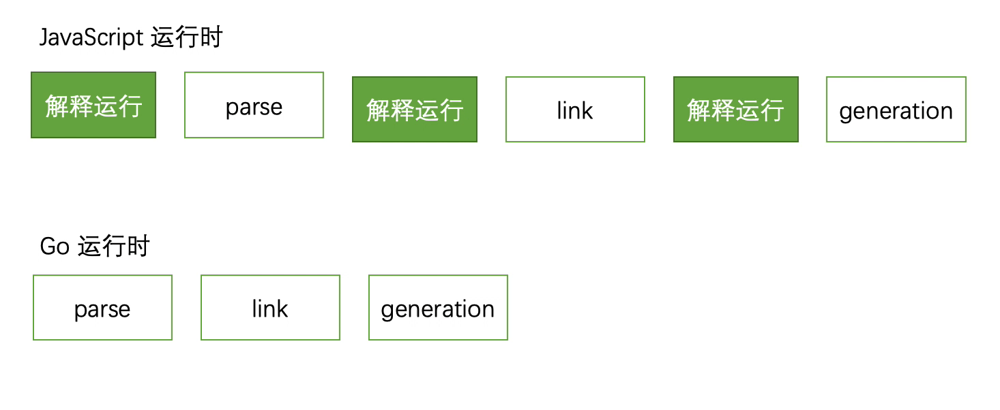

# Esbuild 为什么那么快？

## Esbuild 是什么

Esbuild 是一个非常新的模块打包工具，它提供了与 Webpack、Rollup、Parcel 等工具**相似**的资源打包能力，却有着高的离谱的性能优势：


从上到下，耗时逐步上升达到数百倍的差异，这个巨大的性能优势使得 Esbuild 在一众基于 Node 的构建工具中迅速蹿红，特别是 Vite 2.0 宣布使用 Esbuild 预构建依赖后，前端社区关于它的讨论热度逐渐上升。

那么问题来了，这是怎么做到的？我翻阅了很多资料后，总结了一些关键因素：


下面展开细讲。

## 语言优势

大多数前端打包工具都是基于 JavaScript 实现的，而 Esbuild 则选择使用 Go 语言编写，两种语言各自有其擅长的场景，但是在资源打包这种 CPU 密集场景下，Go 更具性能优势，差距有多大呢？比如计算 50 次斐波那契数列，JS 版本：

``` javascript
function fibonacci(num) {
    if (num < 2) {
        return 1
    }
    return fibonacci(num - 1) + fibonacci(num - 2)
}

(() => {
    let cursor = 0;
    while (cursor < 50) {
        fibonacci(cursor++)
    }
})()
```


Go 版本：

``` go
package main

func fibonacci(num int) int{
    if num<2{
        return 1
    }
    
    return fibonacci(num-1) + fibonacci(num-2)
}

func main(){
    for i := 0; i<50; i++{
        fibonacci(i)
    }
}
```


JavaScript 版本执行耗时大约为 **332.58s**，Go 版本执行耗时大约为 **147.08s**，两者相差约 **1.25** 倍，这个简单实验并不能精确定量两种语言的性能差别，但感官上还是能明显感知 Go 语言在 CPU 密集场景下会有更好的性能表现。

归根到底，虽然现代 JS 引擎与10年前相比有巨大的提升，但 JavaScript 本质上依然是一门解释型语言，JavaScript 程序每次执行都需要先由解释器一边将源码翻译成机器语言，一边调度执行；而 Go 是一种编译型语言，在编译阶段就已经将源码转译为机器码，启动时只需要直接执行这些机器码即可。也就意味着，Go 语言编写的程序比 JavaScript 少了一个动态解释的过程。

这种语言层面的差异在打包场景下特别突出，说的夸张一点，JavaScript 运行时还在解释代码的时候，Esbuild 已经在解析用户代码；JavaScript 运行时解释完代码刚准备启动的时候，Esbuild 可能已经打包完毕，退出进程了！



所以在编译运行层面，Go 前置了源码编译过程，相对 JavaScript 边解释边运行的方式有更高的执行性能。

## 多线程优势

Go 天生具有多线程运行能力，而 JavaScript 本质上是一门单线程语言，直到引入 WebWorker 规范之后才有可能在浏览器、Node 中实现多线程操作。

我曾经研读过 Rollup、Webpack 的代码，就我熟知的范围内两者均未使用 WebWorker 提供的多线程能力。反观 Esbuild，它最核心的卖点就是性能，它的实现算法经过非常精心的设计，尽可能饱和地使用各个 CPU 核，特别是打包过程的解析、代码生成阶段已经实现完全并行处理。


除了 CPU 指令运行层面的并行外，Go 语言多个线程之间还能共享相同的内存空间，而 JavaScript 的每个线程都有自己独有的内存堆。这意味着 Go 中多个处理单元，例如解析资源 A 的线程，可以直接读取资源 B 线程的运行结果，而在 JavaScript 中相同的操作需要调用通讯接口 `woker.postMessage` 在线程间复制数据。


所以在运行时层面，Go 拥有天然的多线程能力，更高效的内存使用率，也就意味着更高的运行性能。

## 节制

对，没错，节制！

Esbuild 并不是另一个 Webpack，它仅仅提供了构建一个现代 Web 应用所需的最小功能集合，未来也不会大规模加入我们业已熟悉的各类构建特性。最新版本 Esbuild 的主要功能特性有：

- 支持 js、ts、jsx、css、json、文本、图片等资源
- 增量更新
- Sourcemap
- 开发服务器支持
- 代码压缩
- Code split
- Tree shaking
- 插件支持

可以看到，这份列表中支持的资源类型、工程化特性非常少，甚至并不足以支撑一个大型项目的开发需求。在这之外，官网明确声明未来没有计划支持如下特性：

- [Elm](https://elm-lang.org/), [Svelte](https://svelte.dev/), [Vue](https://vuejs.org/), [Angular](https://angular.io/) 等代码文件格式
- Ts 类型检查
- AST 相关操作 API
- Hot Module Replace
- Module Federation

而且，Esbuild 所设计的插件系统也无意覆盖以上这些场景，这就意味着第三方开发者无法通过**插件**这种无侵入的方式实现上述功能，emmm，可以预见未来可能会出现很多魔改版本。

Esbuild 只解决一部分问题，所以它的架构复杂度相对较小，相对地编码复杂度也会小很多，相对于 Webpack、Rollup 等大一统的工具，也自然更容易把性能做到极致。节制的功能设计还能带来另外一个好处：完全为性能定制的各种附加工具。

## 定制

回顾一下，在 Webpack、Rollup 这类工具中，我们不得不使用很多额外的第三方插件来解决各种工程需求，比如：

- 使用 babel 实现 ES 版本转译
- 使用 eslint 实现代码检查
- 使用 TSC 实现 ts 代码转译与代码检查
- 使用 less、stylus、sass 等 css 预处理工具

我们已经完全习惯了这种方式，甚至觉得事情就应该是这样的，大多数人可能根本没有意识到事情可以有另一种解决方案。Esbuild 起了个头，选择完全！完全重写整套编译流程所需要用到的所有工具！这意味着它需要重写 js、ts、jsx、json 等资源文件的加载、解析、链接、代码生成逻辑。

开发成本很高，而且可能被动陷入封闭的风险，但收益也是巨大的，它可以一路贯彻原则，以性能为最高优先级定制编译的各个阶段，比如说：

- 重写 ts 转译工具，完全抛弃 ts 类型检查，只做代码转换
- 大多数打包工具把词法分析、语法分析、符号声明等步骤拆解为多个高内聚低耦合的处理单元，各个模块职责分明，可读性、可维护性较高。而 Esbuild 则坚持性能第一原则，不惜采用反直觉的设计模式，将多个处理算法混合在一起降低编译过程数据流转所带来的性能损耗
- 一致的数据结构，以及衍生出的高效缓存策略，下一节细讲

这种深度定制一方面降低了设计成本，能够保持编译链条的架构一致性；一方面能够贯彻性能第一的原则，确保每个环节以及环节之间交互性能的最优。虽然伴随着功能、可读性、可维护性层面的的牺牲，但在编译性能方面几乎做到了极致。

## 结构一致性

上一节我们讲到 Esbuild 选择重写包括 js、ts、jsx、css 等语言在内的转译工具，所以它更能保证源代码在编译步骤之间的结构一致性，比如在 Webpack 中使用 babel-loader 处理 JavaScript 代码时，可能需要经过多次数据转换：

- Webpack 读入源码，此时为字符串形式
- Babel 解析源码，转换为 AST 形式
- Babel 将源码 AST 转换为低版本 AST
- Babel 将低版本 AST generate 为低版本源码，字符串形式
- Webpack 解析低版本源码
- Webpack 将多个模块打包成最终产物

源码需要经历 `string => AST => AST => string => AST => string` ，在字符串与 AST 之间反复横跳。

而 Esbuild 重写大多数转译工具之后，能够在多个编译阶段共用相似的 AST 结构，尽可能减少字符串到 AST 的结构转换，提升内存使用效率。


## 总结

单纯从编译性能的维度看，Esbuild 确实完胜世面上所有打包框架，差距甚至能在百倍之大：

|                      | 耗时   | 性能差异 | 速度            | 产物大小 |
|----------------------|--------|----------|-----------------|----------|
| [Esbuild](https://esbuild.github.io/)              | 0.11s  | 1x       | 1198.5 kloc/s   | 0.97mb   |
| [Esbuild (1 thread)](https://esbuild.github.io/)   | 0.40s  | 4x       | 329.6 kloc/s    | 0.97mb   |
| [webpack 4](https://webpack.js.org/)           | 19.14s | 174x     | 6.9 kloc/s      | 1.26mb   |
| [parcel 1](https://parceljs.org/)             | 22.41s | 204x     | 5.9 kloc/s      | 1.56mb   |
| [webpack 5](https://webpack.js.org/)            | 25.61s | 233x     | 5.1 kloc/s      | 1.26mb   |
| [parcel 2](https://parceljs.org/)             | 31.39s | 285x     | 4.2 kloc/s      | 0.97mb   |

但这是有代价的，刨除语言层面的天然优势外，在功能层面它直接放弃对 less、stylus、sass、vue、angular 等资源的支持，放弃 MF、HMR、TS 类型检查等功能，正如作者所说：

> This will involve saying "no" to requests for adding major features to esbuild itself. I don't think esbuild should become an all-in-one solution for all frontend needs\!

在我看来，Esbuild 当下与未来都不能替代 Webpack，它不适合直接用于生产环境，而更适合作为一种偏底层的模块打包工具，需要在它的基础上二次封装，扩展出一套既兼顾性能又有完备工程化能力的工具链，例如 [Snowpack](https://github.com/snowpackjs/snowpack), [Vite](https://github.com/vitejs/vite), [SvelteKit](https://github.com/sveltejs/kit), [Remix Run](https://remix.run/) 等。

总的来说，Esbuild 提供了一种新的设计思路，值得学习了解，但对大多数业务场景还不适合直接投入生产使用。
