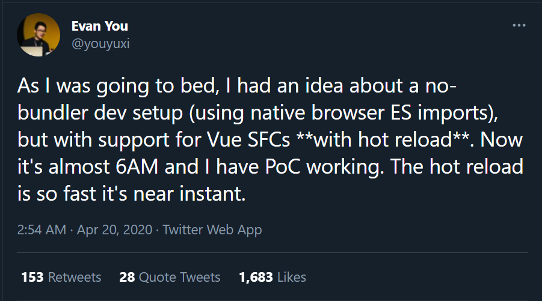
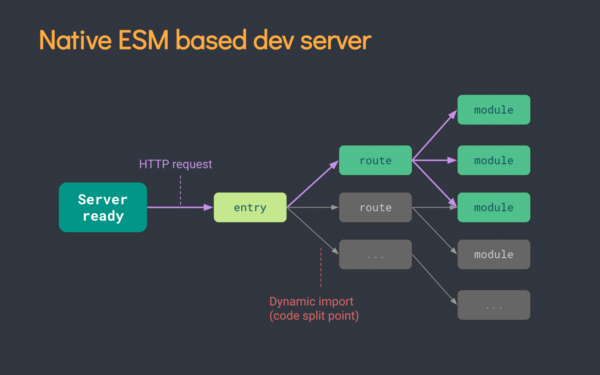
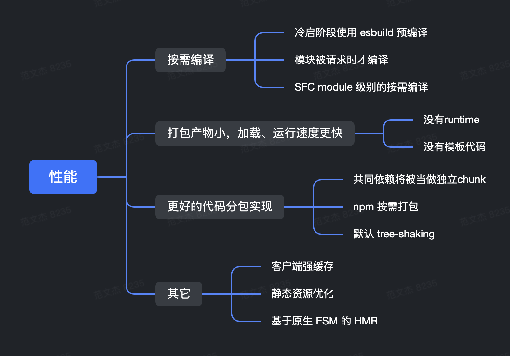

# Vite 的好与坏

## 一、Vite 是什么

2020年4月，尤大大发了这么一个推：



随后，2021年2月，Vite 2.0 它来了，上来就是一套组合拳：

- 基于 [esbuild](https://mp.weixin.qq.com/s/BCL1Cm64mps4cZe_V26Wtw) 实现的极速开发体验
- 多框架支持
- 兼容 Rollup 的插件机制与 API
- SSR 支持
- 旧浏览器支持

一开始我是拒绝的，从 grunt、gulp ，到 Webpack、Rollup、Snowpack 以及若干知名不知名构建框架，都2021了，还来？然后试用了一下，嗯，是真的香！

## 二、Vite 的优势

### 2.1 真的很快

Vite 非常非常快，对比 Vue-cli\(基于 Webpack\)：

<table style="border-collapse: collapse;"><colgroup><col width="87"><col width="161"><col width="221"><col width="171"></colgroup><tbody><tr><td height="31" width="87" style="font-family: LarkHackSafariFont, LarkEmojiFont, LarkChineseQuote, -apple-system, BlinkMacSystemFont, 'Helvetica Neue', Arial, 'Segoe UI', 'PingFang SC', 'Microsoft Yahei', 'Hiragino Sans GB', sans-serif, 'Apple Color Emoji', 'Segoe UI Emoji', 'Segoe UI Symbol', 'Noto Color Emoji';font-size: 16px;font-style: normal;font-weight: normal;line-height: normal;vertical-align: middle;word-wrap:normal;word-break:normal;white-space:nowrap;"></td><td height="31" width="161" data-sheet-value="&quot;Dev 启动时长&quot;" style="font-family: LarkHackSafariFont, LarkEmojiFont, LarkChineseQuote, -apple-system, BlinkMacSystemFont, 'Helvetica Neue', Arial, 'Segoe UI', 'PingFang SC', 'Microsoft Yahei', 'Hiragino Sans GB', sans-serif, 'Apple Color Emoji', 'Segoe UI Emoji', 'Segoe UI Symbol', 'Noto Color Emoji';font-size: 16px;font-style: normal;font-weight: 700;line-height: normal;vertical-align: middle;word-wrap:normal;word-break:normal;white-space:nowrap;">Dev 启动时长</td><td height="31" width="221" data-sheet-value="&quot;Dev 页面加载速度&quot;" style="font-family: LarkHackSafariFont, LarkEmojiFont, LarkChineseQuote, -apple-system, BlinkMacSystemFont, 'Helvetica Neue', Arial, 'Segoe UI', 'PingFang SC', 'Microsoft Yahei', 'Hiragino Sans GB', sans-serif, 'Apple Color Emoji', 'Segoe UI Emoji', 'Segoe UI Symbol', 'Noto Color Emoji';font-size: 16px;font-style: normal;font-weight: 700;line-height: normal;vertical-align: middle;word-wrap:normal;word-break:normal;white-space:nowrap;">Dev 页面加载速度</td><td height="31" width="171" data-sheet-value="&quot;Build 时长&quot;" style="font-family: LarkHackSafariFont, LarkEmojiFont, LarkChineseQuote, -apple-system, BlinkMacSystemFont, 'Helvetica Neue', Arial, 'Segoe UI', 'PingFang SC', 'Microsoft Yahei', 'Hiragino Sans GB', sans-serif, 'Apple Color Emoji', 'Segoe UI Emoji', 'Segoe UI Symbol', 'Noto Color Emoji';font-size: 16px;font-style: normal;font-weight: 700;line-height: normal;vertical-align: middle;word-wrap:normal;word-break:normal;white-space:nowrap;">Build 时长</td></tr><tr><td height="31" width="87" data-sheet-value="&quot;Vue-cli&quot;" style="font-family: LarkHackSafariFont, LarkEmojiFont, LarkChineseQuote, -apple-system, BlinkMacSystemFont, 'Helvetica Neue', Arial, 'Segoe UI', 'PingFang SC', 'Microsoft Yahei', 'Hiragino Sans GB', sans-serif, 'Apple Color Emoji', 'Segoe UI Emoji', 'Segoe UI Symbol', 'Noto Color Emoji';font-size: 16px;font-style: normal;font-weight: normal;line-height: normal;vertical-align: middle;word-wrap:normal;word-break:normal;white-space:nowrap;">Vue-cli</td><td height="31" width="161" data-sheet-value="&quot;2568ms&quot;" style="color: rgb(255, 0, 0);font-family: LarkHackSafariFont, LarkEmojiFont, LarkChineseQuote, -apple-system, BlinkMacSystemFont, 'Helvetica Neue', Arial, 'Segoe UI', 'PingFang SC', 'Microsoft Yahei', 'Hiragino Sans GB', sans-serif, 'Apple Color Emoji', 'Segoe UI Emoji', 'Segoe UI Symbol', 'Noto Color Emoji';font-size: 16px;font-style: normal;font-weight: normal;line-height: normal;vertical-align: middle;word-wrap:normal;word-break:normal;white-space:nowrap;">2568ms</td><td height="31" width="221" data-sheet-value="&quot;320ms&quot;" style="color: rgb(255, 217, 102);font-family: LarkHackSafariFont, LarkEmojiFont, LarkChineseQuote, -apple-system, BlinkMacSystemFont, 'Helvetica Neue', Arial, 'Segoe UI', 'PingFang SC', 'Microsoft Yahei', 'Hiragino Sans GB', sans-serif, 'Apple Color Emoji', 'Segoe UI Emoji', 'Segoe UI Symbol', 'Noto Color Emoji';font-size: 16px;font-style: normal;font-weight: normal;line-height: normal;vertical-align: middle;word-wrap:normal;word-break:normal;white-space:nowrap;">320ms</td><td height="31" width="171" data-sheet-value="&quot;5.14s&quot;" style="color: rgb(255, 0, 0);font-family: LarkHackSafariFont, LarkEmojiFont, LarkChineseQuote, -apple-system, BlinkMacSystemFont, 'Helvetica Neue', Arial, 'Segoe UI', 'PingFang SC', 'Microsoft Yahei', 'Hiragino Sans GB', sans-serif, 'Apple Color Emoji', 'Segoe UI Emoji', 'Segoe UI Symbol', 'Noto Color Emoji';font-size: 16px;font-style: normal;font-weight: normal;line-height: normal;vertical-align: middle;word-wrap:normal;word-break:normal;white-space:nowrap;">5.14s</td></tr><tr><td height="31" width="87" data-sheet-value="&quot;Vite&quot;" style="font-family: LarkHackSafariFont, LarkEmojiFont, LarkChineseQuote, -apple-system, BlinkMacSystemFont, 'Helvetica Neue', Arial, 'Segoe UI', 'PingFang SC', 'Microsoft Yahei', 'Hiragino Sans GB', sans-serif, 'Apple Color Emoji', 'Segoe UI Emoji', 'Segoe UI Symbol', 'Noto Color Emoji';font-size: 16px;font-style: normal;font-weight: normal;line-height: normal;vertical-align: middle;word-wrap:normal;word-break:normal;white-space:nowrap;">Vite</td><td height="31" width="161" data-sheet-value="&quot;232ms&quot;" style="color: rgb(0, 176, 80);font-family: LarkHackSafariFont, LarkEmojiFont, LarkChineseQuote, -apple-system, BlinkMacSystemFont, 'Helvetica Neue', Arial, 'Segoe UI', 'PingFang SC', 'Microsoft Yahei', 'Hiragino Sans GB', sans-serif, 'Apple Color Emoji', 'Segoe UI Emoji', 'Segoe UI Symbol', 'Noto Color Emoji';font-size: 16px;font-style: normal;font-weight: normal;line-height: normal;vertical-align: middle;word-wrap:normal;word-break:normal;white-space:nowrap;">232ms</td><td height="31" width="221" data-sheet-value="&quot;379ms&quot;" style="color: rgb(191, 143, 0);font-family: LarkHackSafariFont, LarkEmojiFont, LarkChineseQuote, -apple-system, BlinkMacSystemFont, 'Helvetica Neue', Arial, 'Segoe UI', 'PingFang SC', 'Microsoft Yahei', 'Hiragino Sans GB', sans-serif, 'Apple Color Emoji', 'Segoe UI Emoji', 'Segoe UI Symbol', 'Noto Color Emoji';font-size: 16px;font-style: normal;font-weight: normal;line-height: normal;vertical-align: middle;word-wrap:normal;word-break:normal;white-space:nowrap;">379ms</td><td height="31" width="171" data-sheet-value="&quot;2.39s&quot;" style="color: rgb(0, 176, 80);font-family: LarkHackSafariFont, LarkEmojiFont, LarkChineseQuote, -apple-system, BlinkMacSystemFont, 'Helvetica Neue', Arial, 'Segoe UI', 'PingFang SC', 'Microsoft Yahei', 'Hiragino Sans GB', sans-serif, 'Apple Color Emoji', 'Segoe UI Emoji', 'Segoe UI Symbol', 'Noto Color Emoji';font-size: 16px;font-style: normal;font-weight: normal;line-height: normal;vertical-align: middle;word-wrap:normal;word-break:normal;white-space:nowrap;">2.39s</td></tr></tbody></table>

> 示例代码：Vue3 项目，10个组件

测试两者的 dev 命令运行耗时相差十倍，且理论上，项目越大性能差距越大，为什么呢？最大的原因是 Vite 在开发模式下并没有做太多打包操作！

Webpack 启动后会做一堆事情，经历一条很长的编译打包链条，从入口开始需要逐步经历语法解析、依赖收集、代码转译、打包合并、代码优化，最终将高版本的、离散的源码编译打包成低版本、高兼容性的产物代码，这可满满都是 CPU、IO 操作啊，在 Node 运行时下性能必然是有问题。

而 Vite 运行 Dev 命令后只做了两件事情，一是启动了一个用于承载资源服务的 service；二是使用 [esbuild](https://mp.weixin.qq.com/s/BCL1Cm64mps4cZe_V26Wtw) 预构建 npm 依赖包。之后就一直躺着，直到浏览器以 http 方式发来 ESM 规范的模块请求时，Vite 才开始“**按需编译**”被请求的模块。



这里 Vite 预设的前提是：

- 现代浏览器大多数已经原生支持 ESM 规范，构建工具 —— 特别是开发环境下已经没有太大必要为了低版本兼容把大量的时间花在编译打包上了！

这么一对比，Webpack 是啥都做了，浏览器只要运行编译好的低版本\(es5\)代码就行；而 Vite 只处理问题的一部分，剩下的事情交由浏览器自行处理，那速度必然贼 TM 快。

除了启动阶段跳过编译操作之外，Vite 还有很多值得一提的性能优化，整体梳理一下：

- 预编译：npm 包这类基本不会变化的模块，使用 Esbuild 在 **预构建** 阶段先打包整理好，减少 http 请求数
- 按需编译：用户代码这一类频繁变动的模块，直到被使用时才会执行编译操作
- 客户端强缓存：请求过的模块会被以 http 头 `max-age=31536000,immutable` 设置为强缓存，如果模块发生变化则用附加的版本 query 使其失效
- 产物优化：相比于 Webpack ，Vite 直接锚定高版本浏览器，不需要在 build 产物中插入过多运行时与模板代码
- 内置更好的分包实现：不需要用户干预，默认启用一系列智能分包规则，尽可能减少模块的重复打包
- 更好的静态资源处理：Vite 尽量避免直接处理静态资源，而是选择遵循 ESM 方式提供服务，例如引入图片 `import img from 'xxx.png'` 语句，执行后 `img` 变量只是一个路径字符串。



可以看出，Vite 的快是全方位的，从 Dev 到 Build，从 npm 包到项目源码，再到静态资源处理都在 ESM 规则框架下尽可能地实现各种优化措施，理论性能急剧提升。

### 2.2 简单

Vite 的用法很简单， 执行初始化命令：

```
yarn create @vitejs/app my-vue-app --template vue
```

就得到了一个预设好的开发环境，可以开始愉快地写 demo 了，Vite 开箱就给你一堆功能，包括 css 预处理器、html 预处理器、hash 命名、异步加载、分包、压缩、HMR 等：


这些功能，作者都按行业最佳实践预设好了，通常不需要用户介入做变更。

Vite 的表现很容易让人联想到 vue-cli，不过两者区别还是挺大的：vue-cli 底层依赖 Webpack，实际的构建工作通常由各种 Webpack loader、plugin 实现，比如 less => css 由 less-loader 实现；图片加载由 img-loader 实现等。这套设计很灵活，你可以在 Webpack 体系下做任何你能想到的变更，只需要学习一点点 Webpack 的知识，包括百来个配置项、成千上万的插件、若干虚无缥缈的构建概念等。

而 Vite 显得特别简洁，它只是暴露了极少数的配置项与 plugin 接口，设计上就没打算让你做太多自定义操作。。。这是因为 Vite 从一开始就没打算做成另一个 Webpack，而是做成一套“能够显著提升前端开发体验的前端构建工具”，重在 **开发体验** 啊同学们，Vite 可谓是用心良苦，想尽办法降低学习入门成本，它就不希望你为了使用工具又学一大堆复杂、缥缈的概念，希望这些事情都在框架层面屏蔽了 —— 虽然代价是丧失灵活性。

简单说吧，Vite 定位就是傻瓜式但强大的构建工具，你专心写好业务代码，早点下班，不用再为了工具费神费力了。

### 2.3 生态

除了极致的运行性能与简易的使用方法外，Vite 对已有生态的兼容性也不容忽略，主要体现在两个点：

- 与 Vue 解耦，兼容支持 React、Svelte、Preact、Vanilla 等，这意味着 Vite 可以被应用在大多数现代技术栈中
- 与 Rollup 极其接近的插件接口，这意味着可以复用 Rollup 生态中大部分已经被反复锤炼的工具

说真的，这两条摆上桌面，加上前面讨论的性能优势和超低学习成本，一时半会真想不到拒绝的理由了。。。

## 三、Vite 的劣势

Vite 还很新，虽然它从理论与体感上提供了非常极致的开发体验，还是有一些值得关注的问题。

### 3.1 兼容性

默认情况下，无论是 dev 还是 build 都会直接打出 ESM 版本的代码包，这就要求客户浏览器需要有一个比较新的版本，这放在现在的国情下还是有点难度的。

不过 Vite 同时提供了一些弥补的方法，使用 `build.polyfillDynamicImport` 配置项配合 [](https://github.com/vitejs/vite/tree/main/packages/plugin-legacy) [\@vitejs/plugin-legacy](https://github.com/vitejs/vite/tree/main/packages/plugin-legacy) 打包出一个看起来兼容性比较好的版本，我相信这一点会随时间慢慢被抹平。

### 3.2 缺少 Show Case

Vite 太新了，直到最近才释放出正式 2.0版本，社区还没太反应过来，自然也就没什么大型、复杂的商业落地案例，谁都说不准这里面可能有多少坑。

不过好消息是社区对 Vite 的搜索热度在最近几个月急剧增长：


> 数据来自谷歌指数

相信很快就会出现一大批布道者，毕竟这玩意儿是真的很有竞争力。

### 3.3 代价

不要忘记，工程化本身的复杂度不会凭空消失，只 Vite 背后的团队在帮我们负重前行，这对 Vite 开发团队而言，维护这么多构建规则是一个不小的负担。而站在用户的角度，越容易上手的工具往往意味着越难被定制。

另外，如果只是在 Vite 预设好的边框里面玩确实很容易，但随着项目复杂度的提高，用户迟早还是会接触到底层的 esbuild 或 Rollup，高工们该补的知识还是迟早还是得补回来，逃不掉的。

## 三、总结

Vite 给我最大的启示：Webpack 并不是标准答案，前端构建工具可以有一些新的玩法：

- **打包** 不是目的，**运行** 才是，2021年了，能够交给浏览器做的事情就交给浏览器吧
- 一个灵活的框架，对作者而言可能意味着逐步失控的开发量；对用户而言可能意味高学习成本，以及不断重复的类似空格好还是 tab 好的争论。那么，一套内置好各种业界 **最佳实践**，没有太多定制空间的工具，某些情况下反而能提升大家的效率

我个人对 Vite 的态度：短期保持观望，长期非常看好。

我相信现在开始上手学习 Vite 是一个不错的选择，这东西封装的太好了，学习成本极低\(吹逼效果极好\)，可以写点 Demo 或者就直接在一些用户范围可控的小型新项目落地。但是，建议不要激进地直接重构一些已有的大型项目，别自己给自己埋坑了，早点下班不香吗。
