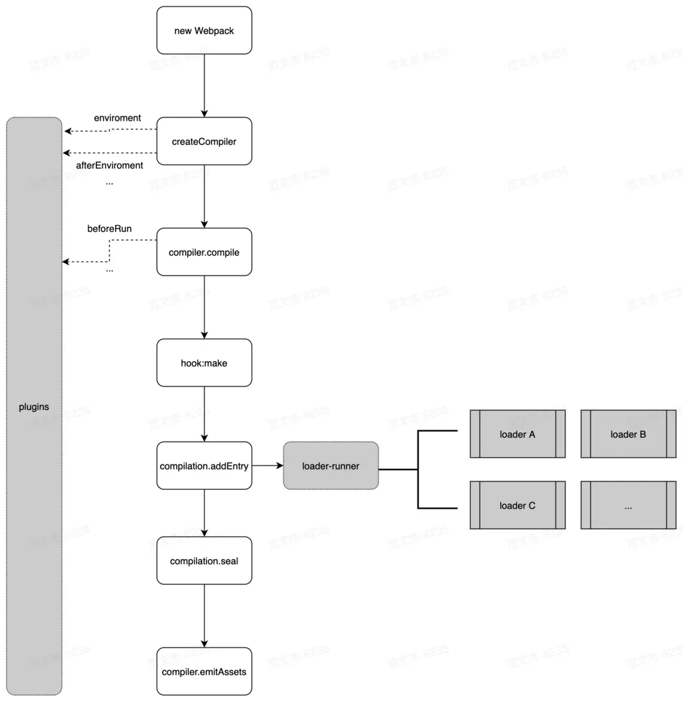
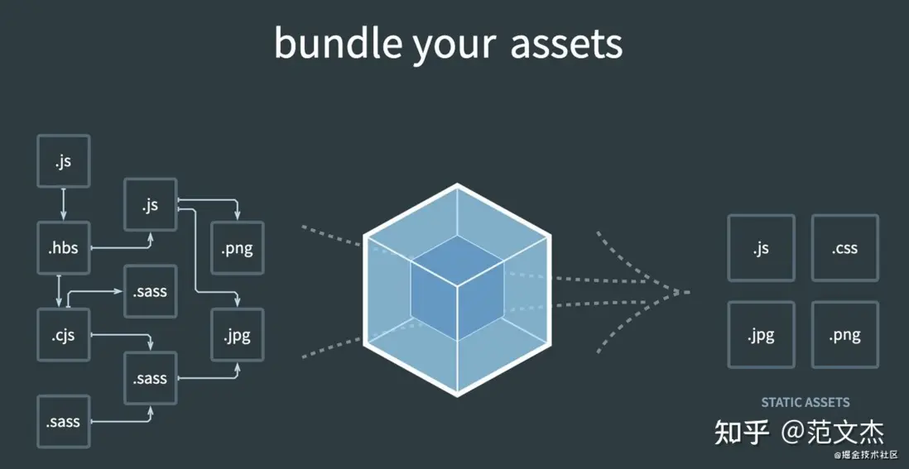
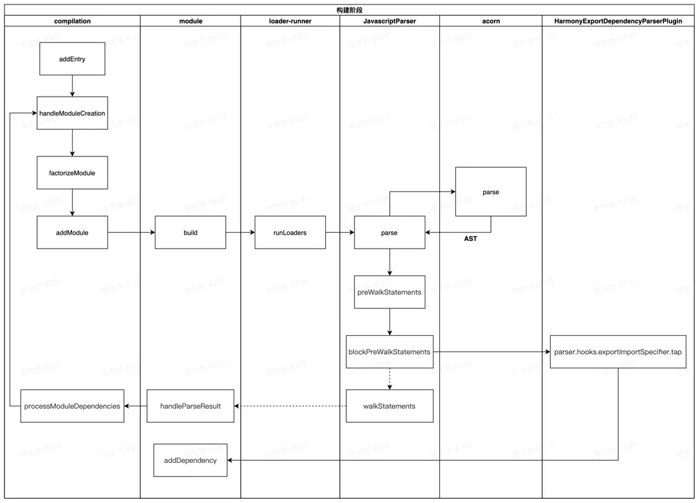
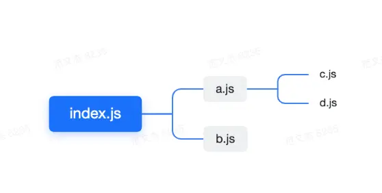
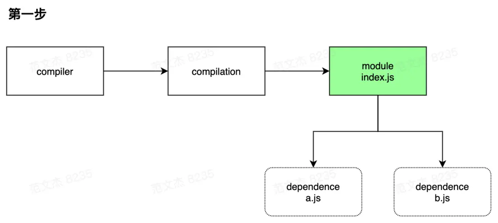
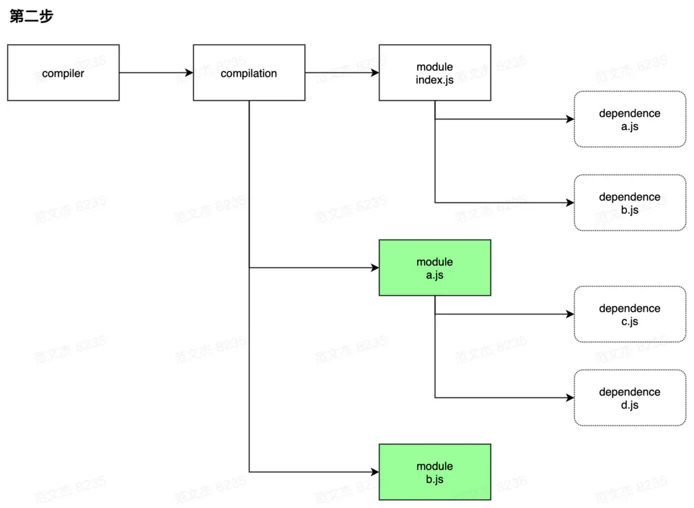
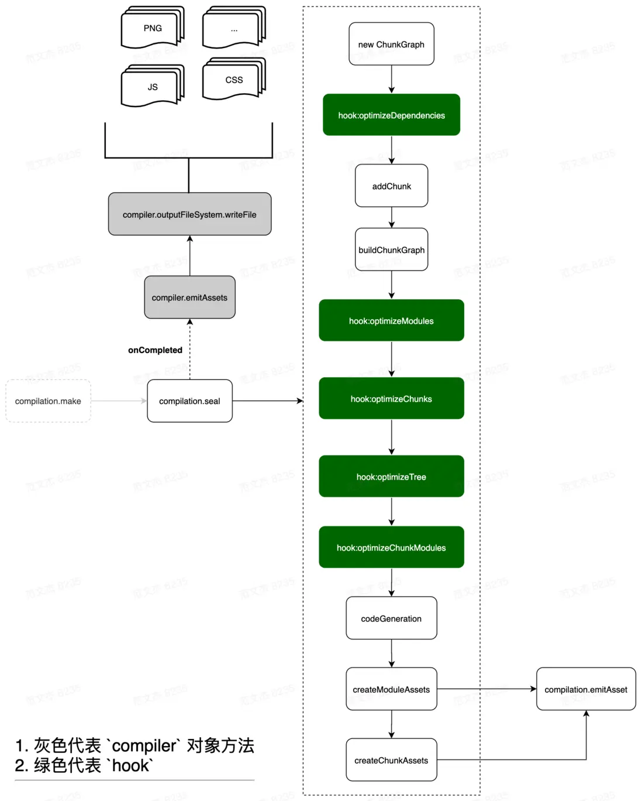
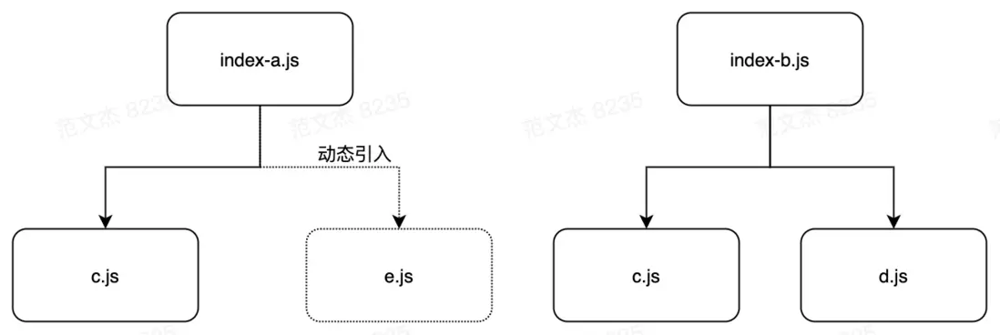
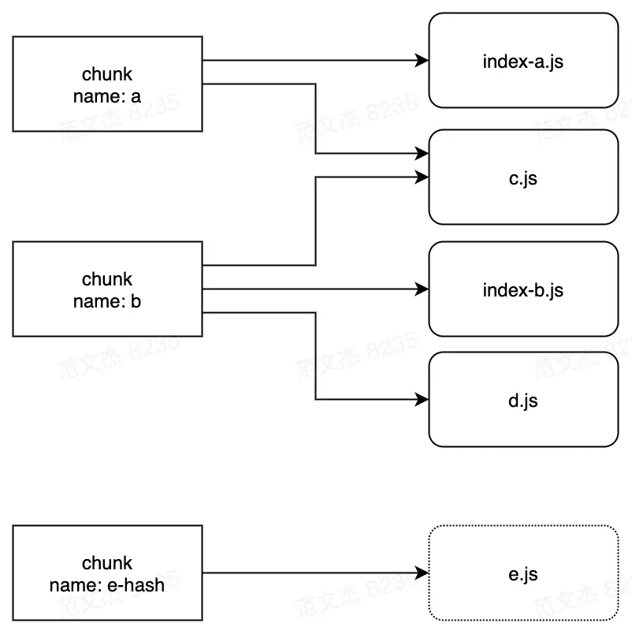
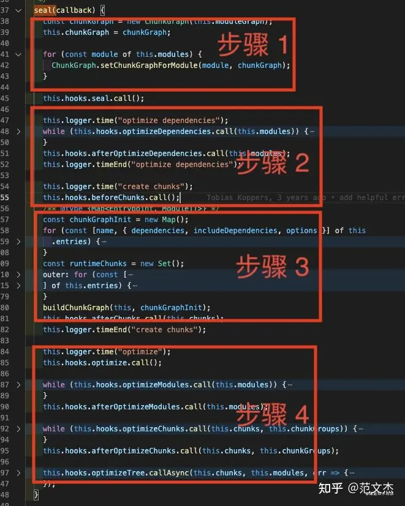

# [万字总结] 一文吃透 Webpack 核心原理

## 背景

Webpack 特别难学！！！

时至 5.0 版本之后，Webpack 功能集变得非常庞大，包括：模块打包、代码分割、按需加载、HMR、Tree-shaking、文件监听、sourcemap、Module Federation、devServer、DLL、多进程等等，为了实现这些功能，webpack 的代码量已经到了惊人的程度：

- 498 份JS文件
- 18862 行注释
- 73548 行代码
- 54 个 module 类型
- 69 个 dependency 类型
- 162 个内置插件
- 237 个hook

在这个数量级下，源码的阅读、分析、学习成本非常高，加上 webpack 官网语焉不详的文档，导致 webpack 的学习、上手成本极其高。为此，社区围绕着 Webpack 衍生出了各种手脚架，比如 [vue-cli](https://cli.vuejs.org/guide/)、[create-react-app](https://reactjs.org/docs/create-a-new-react-app.html)，解决“用”的问题。

但这又导致一个新的问题，大部分人在工程化方面逐渐变成一个配置工程师，停留在“会用会配”但是不知道黑盒里面到底是怎么转的阶段，遇到具体问题就瞎了：

- 想给基础库做个升级，出现兼容性问题跑不动了，直接放弃
- 想优化一下编译性能，但是不清楚内部原理，无从下手

究其原因还是对 webpack 内部运行机制没有形成必要的整体认知，无法迅速定位问题 —— 对，连问题的本质都常常看不出，所谓的不能透过现象看本质，那本质是啥？我个人将 webpack 整个庞大的体系抽象为三方面的知识：

1. **构建的核心流程**
2. **loader 的作用**
3. **plugin 架构与常用套路**

三者协作构成 webpack 的主体框架：



理解了这三块内容就算是入了个门，对 Webpack 有了一个最最基础的认知了，工作中再遇到问题也就能按图索骥了。补充一句，作为一份入门教程，本文不会展开太多 webpack 代码层面的细节 —— 我的精力也不允许，所以读者也不需要看到一堆文字就产生特别大的心理负担。

## 核心流程解析

首先，我们要理解一个点，Webpack 最核心的功能：

> At its core, **webpack** is a _static module bundler_ for modern JavaScript applications.

也就是将各种类型的资源，包括图片、css、js等，转译、组合、拼接、生成 JS 格式的 bundler 文件。[官网首页](https://webpack.js.org/)的动画很形象地表达了这一点：



这个过程核心完成了 **内容转换 + 资源合并** 两种功能，实现上包含三个阶段：

1. 初始化阶段：
    1. **初始化参数**：从配置文件、 配置对象、Shell 参数中读取，与默认配置结合得出最终的参数
    2. **创建编译器对象**：用上一步得到的参数创建 `Compiler` 对象
    3. **初始化编译环境**：包括注入内置插件、注册各种模块工厂、初始化 RuleSet 集合、加载配置的插件等
    4. **开始编译**：执行 `compiler` 对象的 `run` 方法
    5. **确定入口**：根据配置中的 `entry` 找出所有的入口文件，调用 `compilition.addEntry` 将入口文件转换为 `dependence` 对象
2. 构建阶段：
    1. **编译模块\(make\)**：根据 `entry` 对应的 `dependence` 创建 `module` 对象，调用 `loader` 将模块转译为标准 JS 内容，调用 JS 解释器将内容转换为 AST 对象，从中找出该模块依赖的模块，再 递归 本步骤直到所有入口依赖的文件都经过了本步骤的处理
    2. **完成模块编译**：上一步递归处理所有能触达到的模块后，得到了每个模块被翻译后的内容以及它们之间的 **依赖关系图**
3. 生成阶段：
    1. **输出资源\(seal\)**：根据入口和模块之间的依赖关系，组装成一个个包含多个模块的 `Chunk`，再把每个 `Chunk` 转换成一个单独的文件加入到输出列表，这步是可以修改输出内容的最后机会
    2. **写入文件系统\(emitAssets\)**：在确定好输出内容后，根据配置确定输出的路径和文件名，把文件内容写入到文件系统

单次构建过程自上而下按顺序执行，下面会展开聊聊细节，在此之前，对上述提及的各类技术名词不太熟悉的同学，可以先看看简介：

- `Entry`：编译入口，webpack 编译的起点
- `Compiler`：编译管理器，webpack 启动后会创建 `compiler` 对象，该对象一直存活知道结束退出
- `Compilation`：单次编辑过程的管理器，比如 `watch = true` 时，运行过程中只有一个 `compiler` 但每次文件变更触发重新编译时，都会创建一个新的 `compilation` 对象
- `Dependence`：依赖对象，webpack 基于该类型记录模块间依赖关系
- `Module`：webpack 内部所有资源都会以“module”对象形式存在，所有关于资源的操作、转译、合并都是以 “module” 为基本单位进行的
- `Chunk`：编译完成准备输出时，webpack 会将 `module` 按特定的规则组织成一个一个的 `chunk`，这些 `chunk` 某种程度上跟最终输出一一对应
- `Loader`：资源内容转换器，其实就是实现从内容 A 转换 B 的转换器
- `Plugin`：webpack构建过程中，会在特定的时机广播对应的事件，插件监听这些事件，在特定时间点介入编译过程

webpack 编译过程都是围绕着这些关键对象展开的，更详细完整的信息，可以参考 [Webpack 知识图谱](https://juejin.cn/post/6948763207397965855) 。

### 初始化阶段

#### 基本流程

学习一个项目的源码通常都是从入口开始看起，按图索骥慢慢摸索出套路的，所以先来看看 webpack 的初始化过程：


解释一下：

1. 将 `process.args + webpack.config.js` 合并成用户配置
2. 调用 `validateSchema` 校验配置
3. 调用 `getNormalizedWebpackOptions + applyWebpackOptionsBaseDefaults` 合并出最终配置
4. 创建 `compiler` 对象
5. 遍历用户定义的 `plugins` 集合，执行插件的 `apply` 方法
6. 调用 `new WebpackOptionsApply().process` 方法，加载各种内置插件

主要逻辑集中在 `WebpackOptionsApply` 类，webpack 内置了数百个插件，这些插件并不需要我们手动配置，`WebpackOptionsApply` 会在初始化阶段根据配置内容动态注入对应的插件，包括：

- 注入 `EntryOptionPlugin` 插件，处理 `entry` 配置
- 根据 `devtool` 值判断后续用那个插件处理 `sourcemap`，可选值：`EvalSourceMapDevToolPlugin`、`SourceMapDevToolPlugin`、`EvalDevToolModulePlugin`
- 注入 `RuntimePlugin` ，用于根据代码内容动态注入 webpack 运行时

到这里，`compiler` 实例就被创建出来了，相应的环境参数也预设好了，紧接着开始调用 `compiler.compile` 函数：

``` javascript
// 取自 webpack/lib/compiler.js 
class Webpack {
  // ...
  compile(callback) {
    const params = this.newCompilationParams();
    this.hooks.beforeCompile.callAsync(params, err => {
      // ...
      const compilation = this.newCompilation(params);
      this.hooks.make.callAsync(compilation, err => {
        // ...
        this.hooks.finishMake.callAsync(compilation, err => {
          // ...
          process.nextTick(() => {
            compilation.finish(err => {
              compilation.seal(err => {...});
            });
          });
        });
      });
    });
  }
}
```

Webpack 架构很灵活，但代价是牺牲了源码的直观性，比如说上面说的初始化流程，从创建 `compiler` 实例到调用 `make` 钩子，逻辑链路很长：

- 启动 webpack ，触发 `lib/webpack.js` 文件中 `createCompiler` 方法
- `createCompiler` 方法内部调用 `WebpackOptionsApply` 插件
- `WebpackOptionsApply` 定义在 `lib/WebpackOptionsApply.js` 文件，内部根据 `entry` 配置决定注入 `entry` 相关的插件，包括：`DllEntryPlugin`、`DynamicEntryPlugin`、`EntryPlugin`、`PrefetchPlugin`、`ProgressPlugin`、`ContainerPlugin`
- `Entry` 相关插件，如 `lib/EntryPlugin.js` 的 `EntryPlugin` 监听 `compiler.make` 钩子
- `lib/compiler.js` 的 `compile` 函数内调用 `this.hooks.make.callAsync`
- 触发 `EntryPlugin` 的 `make` 回调，在回调中执行 `compilation.addEntry` 函数
- `compilation.addEntry` 函数内部经过一坨与主流程无关的 `hook` 之后，再调用 `handleModuleCreate` 函数，正式开始构建内容

这个过程需要在 webpack 初始化的时候预埋下各种插件，经历 4 个文件，7次跳转才开始进入主题，前戏太足了，如果读者对 webpack 的概念、架构、组件没有足够了解时，源码阅读过程会很痛苦。

关于这个问题，我在文章最后总结了一些技巧和建议，有兴趣的可以滑到附录阅读模块。

### 构建阶段

#### 基本流程

你有没有思考过这样的问题：

- Webpack 编译过程会将源码解析为 AST 吗？webpack 与 babel 分别实现了什么？
- Webpack 编译过程中，如何识别资源对其他资源的依赖？
- 相对于 grunt、gulp 等流式构建工具，为什么 webpack 会被认为是新一代的构建工具？

这些问题，基本上在构建阶段都能看出一些端倪。构建阶段从 `entry` 开始递归解析资源与资源的依赖，在 `compilation` 对象内逐步构建出 `module` 集合以及 `module` 之间的依赖关系，核心流程：



解释一下，构建阶段从入口文件开始：

1. 调用 `handleModuleCreate` ，根据文件类型构建 `module` 子类
2. 调用 [loader-runner](https://www.npmjs.com/package/loader-runner) 仓库的 `runLoaders` 转译 `module` 内容，通常是从各类资源类型转译为 JavaScript 文本
3. 调用 [acorn](https://www.npmjs.com/package/acorn) 将 JS 文本解析为AST
4. 遍历 AST，触发各种钩子
    1. 在 `HarmonyExportDependencyParserPlugin` 插件监听 `exportImportSpecifier` 钩子，解读 JS 文本对应的资源依赖
    2. 调用 `module` 对象的 `addDependency` 将依赖对象加入到 `module` 依赖列表中
5. AST 遍历完毕后，调用 `module.handleParseResult` 处理模块依赖
6. 对于 `module` 新增的依赖，调用 `handleModuleCreate` ，控制流回到第一步
7. 所有依赖都解析完毕后，构建阶段结束

这个过程中数据流 `module => ast => dependences => module` ，先转 AST 再从 AST 找依赖。这就要求 `loaders` 处理完的最后结果必须是可以被 acorn 处理的标准 JavaScript 语法，比如说对于图片，需要从图像二进制转换成类似于 `export default "data:image/png;base64,xxx"` 这类 base64 格式或者 `export default "http://xxx"` 这类 url 格式。

`compilation` 按这个流程递归处理，逐步解析出每个模块的内容以及 `module` 依赖关系，后续就可以根据这些内容打包输出。

#### 示例：层级递进

假如有如下图所示的文件依赖树：



其中 `index.js` 为 `entry` 文件，依赖于 a/b 文件；a 依赖于 c/d 文件。初始化编译环境之后，`EntryPlugin` 根据 `entry` 配置找到 `index.js` 文件，调用 `compilation.addEntry` 函数触发构建流程，构建完毕后内部会生成这样的数据结构：



此时得到 `module[index.js]` 的内容以及对应的依赖对象 `dependence[a.js]` 、`dependence[b.js]` 。OK，这就得到下一步的线索：a.js、b.js，根据上面流程图的逻辑继续调用 `module[index.js]` 的 `handleParseResult` 函数，继续处理 a.js、b.js 文件，递归上述流程，进一步得到 a、b 模块：



从 a.js 模块中又解析到 c.js/d.js 依赖，于是再再继续调用 `module[a.js]` 的 `handleParseResult` ，再再递归上述流程：


到这里解析完所有模块后，发现没有更多新的依赖，就可以继续推进，进入下一步。

#### 总结

回顾章节开始时提到的问题：

- Webpack 编译过程会将源码解析为 AST 吗？webpack 与 babel 分别实现了什么？
  - 构建阶段会读取源码，解析为 AST 集合。
  - Webpack 读出 AST 之后仅遍历 AST 集合；babel 则对源码做等价转换
- Webpack 编译过程中，如何识别资源对其他资源的依赖？
  - Webpack 遍历 AST 集合过程中，识别 `require/ import` 之类的导入语句，确定模块对其他资源的依赖关系
- 相对于 grant、gulp 等流式构建工具，为什么 webpack 会被认为是新一代的构建工具？
  - Grant、Gulp 仅执行开发者预定义的任务流；而 webpack 则深入处理资源的内容，功能上更强大

### 生成阶段

#### 基本流程

构建阶段围绕 `module` 展开，生成阶段则围绕 `chunks` 展开。经过构建阶段之后，webpack 得到足够的模块内容与模块关系信息，接下来开始生成最终资源了。代码层面，就是开始执行 `compilation.seal` 函数：

``` javascript
// 取自 webpack/lib/compiler.js 
compile(callback) {
    const params = this.newCompilationParams();
    this.hooks.beforeCompile.callAsync(params, err => {
      // ...
      const compilation = this.newCompilation(params);
      this.hooks.make.callAsync(compilation, err => {
        // ...
        this.hooks.finishMake.callAsync(compilation, err => {
          // ...
          process.nextTick(() => {
            compilation.finish(err => {
              **compilation.seal**(err => {...});
            });
          });
        });
      });
    });
  }
```

`seal` 原意密封、上锁，我个人理解在 webpack 语境下接近于 **“将模块装进蜜罐”** 。`seal` 函数主要完成从 `module` 到 `chunks` 的转化，核心流程：



简单梳理一下：

1. 构建本次编译的 `ChunkGraph` 对象；
2. 遍历 `compilation.modules` 集合，将 `module` 按 `entry/动态引入` 的规则分配给不同的 `Chunk` 对象；
3. `compilation.modules` 集合遍历完毕后，得到完整的 `chunks` 集合对象，调用 `createXxxAssets` 方法
4. `createXxxAssets` 遍历 `module/chunk` ，调用 `compilation.emitAssets` 方法将资 `assets` 信息记录到 `compilation.assets` 对象中
5. 触发 `seal` 回调，控制流回到 `compiler` 对象

这一步的关键逻辑是将 `module` 按规则组织成 `chunks` ，webpack 内置的 `chunk` 封装规则比较简单：

- `entry` 及 entry 触达到的模块，组合成一个 `chunk`
- 使用动态引入语句引入的模块，各自组合成一个 `chunk`

`chunk` 是输出的基本单位，默认情况下这些 `chunks` 与最终输出的资源一一对应，那按上面的规则大致上可以推导出一个 `entry` 会对应打包出一个资源，而通过动态引入语句引入的模块，也对应会打包出相应的资源，我们来看个示例。

#### 示例：多入口打包

假如有这样的配置：

```
const path = require("path");

module.exports = {
  mode: "development",
  context: path.join(__dirname),
  entry: {
    a: "./src/index-a.js",
    b: "./src/index-b.js",
  },
  output: {
    filename: "[name].js",
    path: path.join(__dirname, "./dist"),
  },
  devtool: false,
  target: "web",
  plugins: [],
};
```

实例配置中有两个入口，对应的文件结构：



`index-a` 依赖于c，且动态引入了 e；`index-b` 依赖于 c/d 。根据上面说的规则：

- **`entry` 及entry触达到的模块，组合成一个 chunk**
- **使用动态引入语句引入的模块，各自组合成一个 chunk**

生成的 `chunks` 结构为：



也就是根据依赖关系，`chunk[a]` 包含了 `index-a/c` 两个模块；`chunk[b]` 包含了 `c/index-b/d` 三个模块；`chunk[e-hash]` 为动态引入 `e` 对应的 chunk。

不知道大家注意到没有，`chunk[a]` 与 `chunk[b]` 同时包含了 c，这个问题放到具体业务场景可能就是，一个多页面应用，所有页面都依赖于相同的基础库，那么这些所有页面对应的 `entry` 都会包含有基础库代码，这岂不浪费？为了解决这个问题，webpack 提供了一些插件如 `CommonsChunkPlugin` 、`SplitChunksPlugin`，在基本规则之外进一步优化 `chunks` 结构。

#### `SplitChunksPlugin` 的作用

`SplitChunksPlugin` 是 webpack 架构高扩展的一个绝好的示例，我们上面说了 webpack 主流程里面是按 `entry / 动态引入` 两种情况组织 `chunks` 的，这必然会引发一些不必要的重复打包，webpack 通过插件的形式解决这个问题。

回顾 `compilation.seal` 函数的代码，大致上可以梳理成这么4个步骤：

1. 遍历 `compilation.modules` ，记录下模块与 `chunk` 关系
2. 触发各种模块优化钩子，这一步优化的主要是模块依赖关系
3. 遍历 `module` 构建 chunk 集合
4. 触发各种优化钩子



上面 1-3 都是预处理 + chunks 默认规则的实现，不在我们讨论范围，这里重点关注第4个步骤触发的 `optimizeChunks` 钩子，这个时候已经跑完主流程的逻辑，得到 `chunks` 集合，`SplitChunksPlugin` 正是使用这个钩子，分析 `chunks` 集合的内容，按配置规则增加一些通用的 chunk ：

``` javascript
module.exports = class SplitChunksPlugin {
  constructor (options = {}) {
    // ...
  }

  _getCacheGroup (cacheGroupSource) {
    // ...
  }

  apply (compiler) {
    // ...
    compiler.hooks.thisCompilation.tap('SplitChunksPlugin', (compilation) => {
      // ...
      compilation.hooks.optimizeChunks.tap(
        {
          name: 'SplitChunksPlugin',
          stage: STAGE_ADVANCED
        },
        (chunks) => {
          // ...
        }
      )
    })
  }
}
```

理解了吗？webpack 插件架构的高扩展性，使得整个编译的主流程是可以固化下来的，分支逻辑和细节需求“外包”出去由第三方实现，这套规则架设起了庞大的 webpack 生态，关于插件架构的更多细节，下面 `plugin` 部分有详细介绍，这里先跳过。

#### 写入文件系统

经过构建阶段后，`compilation` 会获知资源模块的内容与依赖关系，也就知道“输入”是什么；而经过 `seal` 阶段处理后， `compilation` 则获知资源输出的图谱，也就是知道怎么“输出”：哪些模块跟那些模块“绑定”在一起输出到哪里。`seal` 后大致的数据结构：

```
compilation = {
  // ...
  modules: [
    /* ... */
  ],
  chunks: [
    {
      id: "entry name",
      files: ["output file name"],
      hash: "xxx",
      runtime: "xxx",
      entryPoint: {xxx}
      // ...
    },
    // ...
  ],
};
```

`seal` 结束之后，紧接着调用 `compiler.emitAssets` 函数，函数内部调用 `compiler.outputFileSystem.writeFile` 方法将 `assets` 集合写入文件系统，实现逻辑比较曲折，但是与主流程没有太多关系，所以这里就不展开讲了。

### 资源形态流转

OK，上面已经把逻辑层面的构造主流程梳理完了，这里结合**资源形态流转**的角度重新考察整个过程，加深理解：


- `compiler.make` 阶段：
  - `entry` 文件以 `dependence` 对象形式加入 `compilation` 的依赖列表，`dependence` 对象记录有 `entry` 的类型、路径等信息
  - 根据 `dependence` 调用对应的工厂函数创建 `module` 对象，之后读入 `module` 对应的文件内容，调用 `loader-runner` 对内容做转化，转化结果若有其它依赖则继续读入依赖资源，重复此过程直到所有依赖均被转化为 `module`
- `compilation.seal` 阶段：
  - 遍历 `module` 集合，根据 `entry` 配置及引入资源的方式，将 `module` 分配到不同的 `chunk`
  - 遍历 `chunk` 集合，调用 `compilation.emitAsset` 方法标记 `chunk` 的输出规则，即转化为 `assets` 集合
- `compiler.emitAssets` 阶段：
  - 将 `assets` 写入文件系统

## Plugin 解析

网上不少资料将 webpack 的插件架构归类为“事件/订阅”模式，我认为这种归纳有失偏颇。订阅模式是一种松耦合架构，发布器只是在特定时机发布事件消息，订阅者并不或者很少与事件直接发生交互，举例来说，我们平常在使用 HTML 事件的时候很多时候只是在这个时机触发业务逻辑，很少调用上下文操作。而 webpack 的钩子体系是一种强耦合架构，它在特定时机触发钩子时会附带上足够的上下文信息，插件定义的钩子回调中，能也只能与这些上下文背后的数据结构、接口交互产生 **side effect**，进而影响到编译状态和后续流程。

学习插件架构，需要理解三个关键问题：

- **WHAT:** 什么是插件
- **WHEN:** 什么时间点会有什么钩子被触发
- **HOW:** 在钩子回调中，如何影响编译状态

### What: 什么是插件

从形态上看，插件通常是一个带有 `apply` 函数的类：

``` javascript
class SomePlugin {
  apply (compiler) {
  }
}
```

`apply` 函数运行时会得到参数 `compiler` ，以此为起点可以调用 `hook` 对象注册各种钩子回调，例如： `compiler.hooks.make.tapAsync` ，这里面 `make` 是钩子名称，`tapAsync` 定义了钩子的调用方式，webpack 的插件架构基于这种模式构建而成，插件开发者可以使用这种模式在钩子回调中，插入特定代码。webpack 各种内置对象都带有 `hooks` 属性，比如 `compilation` 对象：

```javascript
class SomePlugin {
  apply (compiler) {
    compiler.hooks.thisCompilation.tap('SomePlugin', (compilation) => {
      compilation.hooks.optimizeChunkAssets.tapAsync('SomePlugin', () => {})
    })
  }
}
```

钩子的核心逻辑定义在 [Tapable](https://github.com/webpack/tapable) 仓库，内部定义了如下类型的钩子：

``` javascript
const {
  SyncHook,
  SyncBailHook,
  SyncWaterfallHook,
  SyncLoopHook,
  AsyncParallelHook,
  AsyncParallelBailHook,
  AsyncSeriesHook,
  AsyncSeriesBailHook,
  AsyncSeriesWaterfallHook
} = require('tapable')
```

不同类型的钩子根据其并行度、熔断方式、同步异步，调用方式会略有不同，插件开发者需要根据这些的特性，编写不同的交互逻辑，这部分内容也特别多，回头展开聊聊。

### When: 什么时候会触发钩子

了解 webpack 插件的基本形态之后，接下来需要弄清楚一个问题：webpack 会在什么时间节点触发什么钩子？这一块我认为是知识量最大的一部分，毕竟源码里面有237个钩子，但官网只介绍了不到100个，且官网对每个钩子的说明都太简短，就我个人而言看完并没有太大收获，所以有必要展开聊一下这个话题。先看几个例子：

- `compiler.hooks.compilation` ：
  - 时机：启动编译创建出 compilation 对象后触发
  - 参数：当前编译的 compilation 对象
  - 示例：很多插件基于此事件获取 compilation 实例
- `compiler.hooks.make`：
  - 时机：正式开始编译时触发
  - 参数：同样是当前编译的 `compilation` 对象
  - 示例：webpack 内置的 `EntryPlugin` 基于此钩子实现 `entry` 模块的初始化
- `compilation.hooks.optimizeChunks` ：
  - 时机： `seal` 函数中，`chunk` 集合构建完毕后触发
  - 参数：`chunks` 集合与 `chunkGroups` 集合
  - 示例： `SplitChunksPlugin` 插件基于此钩子实现 `chunk` 拆分优化
- `compiler.hooks.done`：
  - 时机：编译完成后触发
  - 参数： `stats` 对象，包含编译过程中的各类统计信息
  - 示例： `webpack-bundle-analyzer` 插件基于此钩子实现打包分析

这是我总结的钩子的三个学习要素：触发时机、传递参数、示例代码。

#### 触发时机

触发时机与 webpack 工作过程紧密相关，大体上从启动到结束，`compiler` 对象逐次触发如下钩子：


而 `compilation` 对象逐次触发：


所以，理解清楚前面说的 webpack 工作的主流程，基本上就可以捋清楚“什么时候会触发什么钩子”。

#### 参数

传递参数与具体的钩子强相关，官网对这方面没有做出进一步解释，我的做法是直接在源码里面搜索调用语句，例如对于 `compilation.hooks.optimizeTree` ，可以在 webpack 源码中搜索 `hooks.optimizeTree.call` 关键字，就可以找到调用代码：

``` javascript
// lib/compilation.js#2297
this.hooks.optimizeTree.callAsync(this.chunks, this.modules, err => {
})
```

结合代码所在的上下文，可以判断出此时传递的是经过优化的 `chunks` 及 `modules` 集合。

#### 找到示例

Webpack 的钩子复杂程度不一，我认为最好的学习方法还是带着目的去查询其他插件中如何使用这些钩子。例如，在 `compilation.seal` 函数内部有 `optimizeModules` 和 `afterOptimizeModules` 这一对看起来很对偶的钩子，`optimizeModules` 从字面上可以理解为用于优化已经编译出的 `modules` ，那 `afterOptimizeModules` 呢？

从 webpack 源码中唯一搜索到的用途是 `ProgressPlugin` ，大体上逻辑如下：

``` javascript
compilation.hooks.afterOptimizeModules.intercept({
  name: 'ProgressPlugin',
  call () {
    handler(percentage, 'sealing', title)
  },
  done () {
    progressReporters.set(compiler, undefined)
    handler(percentage, 'sealing', title)
  },
  result () {
    handler(percentage, 'sealing', title)
  },
  error () {
    handler(percentage, 'sealing', title)
  },
  tap (tap) {
    // p is percentage from 0 to 1
    // args is any number of messages in a hierarchical matter
    progressReporters.set(compilation.compiler, (p, ...args) => {
      handler(percentage, 'sealing', title, tap.name, ...args)
    })
    handler(percentage, 'sealing', title, tap.name)
  }
})
```

基本上可以猜测出，`afterOptimizeModules` 的设计初衷就是用于通知优化行为的结束。

`apply` 虽然是一个函数，但是从设计上就只有输入，webpack 不 care 输出，所以在插件中只能通过调用类型实体的各种方法来或者更改实体的配置信息，变更编译行为。例如：

- [compilation.addModule](https://webpack.js.org/api/compilation-object/#addmodule) ：添加模块，可以在原有的 module 构建规则之外，添加自定义模块
- [compilation.emitAsset](https://webpack.js.org/api/compilation-object/#emitasset)：直译是“提交资产”，功能可以理解将内容写入到特定路径

到这里，插件的工作机理和写法已经有一个很粗浅的介绍了，回头单拎出来细讲吧。

### How: 如何影响编译状态

解决上述两个问题之后，我们就能理解“如何将特定逻辑插入 webpack 编译过程”，接下来才是重点 —— 如何影响编译状态？强调一下，webpack 的插件体系与平常所见的 订阅/发布 模式差别很大，是一种非常强耦合的设计，hooks 回调由 webpack 决定何时，以何种方式执行；而在 hooks 回调内部可以通过修改状态、调用上下文 api 等方式对 webpack 产生 **side effect**。

比如，`EntryPlugin` 插件：

``` javascript
class EntryPlugin {
  apply (compiler) {
    compiler.hooks.compilation.tap(
      'EntryPlugin',
      (compilation, { normalModuleFactory }) => {
        compilation.dependencyFactories.set(
          EntryDependency,
          normalModuleFactory
        )
      }
    )

    compiler.hooks.make.tapAsync('EntryPlugin', (compilation, callback) => {
      const { entry, options, context } = this

      const dep = EntryPlugin.createDependency(entry, options)
      compilation.addEntry(context, dep, options, (err) => {
        callback(err)
      })
    })
  }
}
```

上述代码片段调用了两个影响 `compilation` 对象状态的接口：

- `compilation.dependencyFactories.set`
- `compilation.addEntry`

操作的具体含义可以先忽略，这里要理解的重点是，webpack 会将上下文信息以参数或 `this` \(compiler 对象\) 形式传递给钩子回调，在回调中可以调用上下文对象的方法或者直接修改上下文对象属性的方式，对原定的流程产生 side effect。所以想纯熟地编写插件，除了要理解调用时机，还需要了解我们可以用哪一些api，例如：

- `compilation.addModule`：添加模块，可以在原有的 `module` 构建规则之外，添加自定义模块
- `compilation.emitAsset`：直译是“提交资产”，功能可以理解将内容写入到特定路径
- `compilation.addEntry`：添加入口，功能上与直接定义 `entry` 配置相同
- `module.addError`：添加编译错误信息
- ...

## Loader 介绍

Loader 的作用和实现比较简单，容易理解，所以简单介绍一下就行了。回顾 loader 在编译流程中的生效的位置：


流程图中， `runLoaders` 会调用用户所配置的 loader 集合读取、转译资源，此前的内容可以千奇百怪，但转译之后理论上应该输出标准 JavaScript 文本或者 AST 对象，webpack 才能继续处理模块依赖。

理解了这个基本逻辑之后，loader 的职责就比较清晰了，不外乎是将内容 A 转化为内容 B，但是在具体用法层面还挺多讲究的，有 pitch、pre、post、inline 等概念用于应对各种场景。

为了帮助理解，这里补充一个示例： [Webpack 案例 -- vue-loader 原理分析](https://juejin.cn/post/6937125495439900685)。

## 附录

### 源码阅读技巧

- **避重就轻：** 挑软柿子捏，比如初始化过程虽然绕，但是相对来说是概念最少、逻辑最清晰的，那从这里入手摸清整个工作过程，可以习得 webpack 的一些通用套路，例如钩子的设计与作用、编码规则、命名习惯、内置插件的加载逻辑等，相当于先入了个门
- **学会调试：** 多用 `ndb` 单点调试功能追踪程序的运行，虽然 node 的调试有很多种方法，但是我个人更推荐 `ndb` ，灵活、简单，配合 `debugger` 语句是大杀器
- **理解架构：** 某种程度上可以将 webpack 架构简化为 `compiler + compilation + plugins` ，webpack 运行过程中只会有一个 `compiler` ；而每次编译 —— 包括调用 `compiler.run` 函数或者 `watch = true` 时文件发生变更，都会创建一个 `compilation` 对象。理解这三个核心对象的设计、职责、协作，差不多就能理解 webpack 的核心逻辑了
- **抓大放小：** plugin 的关键是“钩子”，我建议战略上重视，战术上忽视！钩子毕竟是 webpack 的关键概念，是整个插件机制的根基，学习 webpack 根本不可能绕过钩子，但是相应的逻辑跳转实在太绕太不直观了，看代码的时候一直揪着这个点的话，复杂性会剧增，我的经验是：
  - 认真看一下 tapable 仓库的文档，或者粗略看一下 `tapable` 的源码，理解同步钩子、异步钩子、promise 钩子、串行钩子、并行钩子等概念，对 `tapable` 提供的事件模型有一个较为精细的认知，这叫战略上重视
  - 遇到不懂的钩子别慌，我的经验我连这个类都不清楚干啥的，要去理解这些钩子实在太难了，不如先略过钩子本身的含义，去看那些插件用到了它，然后到插件哪里去加 `debugger` 语句单点调试，等你缕清后续逻辑的时候，大概率你也知道钩子的含义了，这叫战术上忽视
- **保持好奇心：** 学习过程保持旺盛的好奇心和韧性，善于 \& 敢于提出问题，然后基于源码和社区资料去总结出自己的答案，问题可能会很多，比如：
  - loader 为什么要设计 pre、pitch、post、inline？
  - `compilation.seal` 函数内部设计了很多优化型的钩子，为什么需要区分的这么细？webpack 设计者对不同钩子有什么预期？
  - 为什么需要那么多 `module` 子类？这些子类分别在什么时候被使用？

### `Module` 与 `Module` 子类

从上文可以看出，webpack 构建阶段的核心流程基本上都围绕着 `module` 展开，相信接触过、用过 Webpack 的读者对 `module` 应该已经有一个感性认知，但是实现上 `module` 的逻辑是非常复杂繁重的。

以 webpack\@5.26.3 为例，直接或间接继承自 `Module` \(`webpack/lib/Module.js` 文件\) 的子类有54个：


要一个一个捋清楚这些类的作用实在太累了，我们需要抓住本质：`module` 的作用是什么？

`module` 是 webpack 资源处理的基本单位，可以认为 webpack 对资源的路径解析、读入、转译、分析、打包输出，所有操作都是围绕着 module 展开的。有很多文章会说 **module = 文件**， 其实这种说法并不准确，比如子类 `AsyncModuleRuntimeModule` 就只是一段内置的代码，是一种资源而不能简单等价于实际文件。

Webpack 扩展性很强，包括模块的处理逻辑上，比如说入口文件是一个普通的 js，此时首先创建 NormalModule 对象，在解析 AST 时发现这个文件里还包含了异步加载语句，例如 `requere.ensure` ，那么相应地会创建 `AsyncModuleRuntimeModule` 模块，注入异步加载的模板代码。上面类图的 54 个 module 子类都是为适配各种场景设计的。


