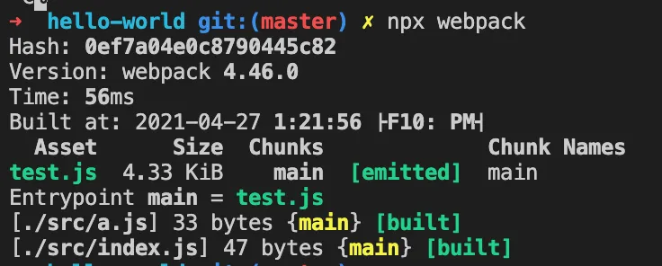
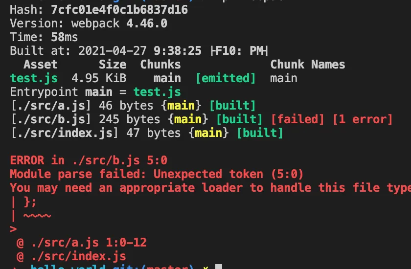
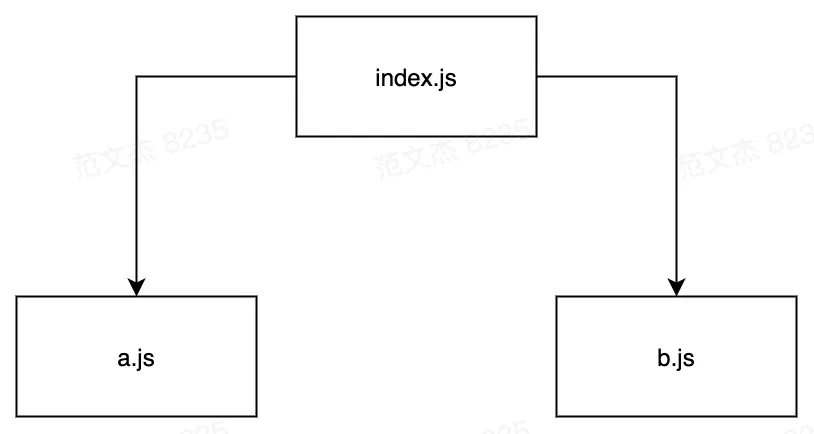

# 十分钟精进 Webpack：module.issuer 属性详解

本文讲解 webpack 的 `module.issuer` 属性，内容涵盖该属性的作用、运行原理，并结合 webpack 实例讲解应用场景。

## module.issuer 是什么

在 webpack 实现上，文件资源使用 `Module` 类管理，所有关于资源的操作、转译、合并、关系都在 `module` 实现。而 `module.issuer` 属性用于记录资源的引用者，例如对于下面的资源依赖：


`index` 引用了 `a/b` 两个文件，webpack 构建时会用三个 `module` 对象分别对应三个文件，同时在 `a/b` 模块中通过 `issuer` 属性指向 `index` 模块：

- `module['a.js'].issuer = module['index.js']`

- `module['b.js'].issuer = module['index.js']`

通过 `issuer` 属性，模块可以反向查找到引用者。

## 实例： Stats 类

`Stats` 是 webpack 内置的对象，用于收集构建过程信息，比如耗时、模块依赖关系、错误信息、报警信息等，我们运行 webpack 命令输出的命令行信息就是由 `Stats` 类提供的：



如果编译过程发生错误，`Stats` 会通过 `module.issuer` 属性逐级往上查找出完整调用堆栈：

``` javascript
class Stats {
  constructor(compilation) {
    // ...
  }
  toJson(options, forToString) {
    const formatError = (e) => {
      // ...
      if (showModuleTrace && e.origin) {
        text += `\n @ ${this.formatFilePath(
          e.origin.readableIdentifier(requestShortener)
        )}`;
        // ...
        while (current.issuer) {
          current = current.issuer;
          text += `\n @ ${current.readableIdentifier(requestShortener)}`;
        }
      }
      return text;
    };
  }
}
```

最终输出下图最后两行错误堆栈：



## 源码

issuer 属性定义在 `webpack/lib/Module.js` 的 `construct` 函数，但 webpack 中使用较少，难以追踪，这里取了个巧，用 `Object.defineProperty` 拦截 `issuer` 属性，定位出哪里获取/修改了这个属性：

``` javascript
// webpack/lib/Module.js
class Module extends DependenciesBlock {
  constructor(type, context = null) {
    // ...
    // 注释掉原本的定义
    // this.issuer = null;
    // 用 Object.defineProperty 拦截
    this._issuer=null;
    Object.defineProperty(this, "issuer", {
        get: () => {
            debugger;
            return this._issuer;
        },
        set: (value) => {
            debugger;
            this._issuer = value;
        },
    });
    // ...
  }
}
```

之后，使用 `ndb` 断点追踪 `issuer` 的使用情况，可以看到只有在 `compilation` 对象的 `addModuleDependencies` 函数中触发 `set` 函数：

``` javascript
class Compilation {
  addModuleDependencies(
    module,
    dependencies,
    bail,
    cacheGroup,
    recursive,
    callback
  ) {
    // ...
    if (addModuleResult.issuer) {
      if (currentProfile) {
        dependentModule.profile = currentProfile;
      }
      // 触发更改
      dependentModule.issuer = module;
    }
    // ...
  }
}
```

`addModuleDependencies` 函数的作用是为已有 `module` 添加依赖声明，例如对于上面的例子：



在 `compilation` 解析\(解析过程可参考： [\[万字总结\] 一文吃透 Webpack 核心原理](https://zhuanlan.zhihu.com/p/363928061)\)出 `index.js` 内容的 AST 后，遍历 `require/import` 语句解读当前模块引用了那些资源，解析到任意依赖后就会调用 `addModuleDependencies` 记录依赖关系，从 `addModuleDependencies` 源码看在依赖被创建为 `module` 时，会同步修改新模块的 `issuer` ，记录引用者的信息。

## 示例： 追溯模块引用关系

基于 `module.issuer` ，我们可以从特定 `module` 出发反向遍历依赖关系链，为此我写了个示例插件：

``` javascript
function RevertTracePlugin(options) {
}

RevertTracePlugin.prototype.apply = function(compiler) {
  // compilation 被创建出来后触发
  compiler.hooks.thisCompilation.tap("RevertTracePlugin", function(compilation) {
    // 构建模块前触发
    compilation.hooks.buildModule.tap("RevertTracePlugin", (module) => {
      const stack = [];
      let current = module;
      // 向上遍历，找出所有引用者
      while (current.issuer) {
        stack.push(current.issuer.rawRequest);
        current = current.issuer;
      }
      if (stack.length > 0) {
        console.group(`资源 ${module.rawRequest} 引用链： `);
        console.log(stack.join("\n"));
        console.groupEnd();
        console.log();
      }
    });
  });
};
```

上述插件用到两个钩子：

- `compiler.hooks.thisCompilation`：webpack 启动编译，创建出 `compilation` 对象时触发，在示例场景中作为中间步骤，用于获取创建出的 `compilation` 对象

- `compilation.hooks.buildModule` ：执行模块构建之前触发，此时 `module` 对象所有原信息都初始化完毕，可以正常获取到 `issuer` 属性

> 关于 webpack 钩子的更多内容，可查阅往前文章： [\[源码解读\] Webpack 插件架构深度讲解](https://zhuanlan.zhihu.com/p/367931462)

在 `buildModule` 钩子内部通过 `while` 循环不断向上遍历，最终可追溯到完整引用链条，例如对于下图的文件依赖关系：


入口 `index.js` 文件引用了 `a.js`，`a.js` 文件引用了 `b.js`，上述插件运行效果：


## 总结

`module.issuer` 属性在 webpack 中使用的比较少，因为大多数时候模块间的依赖关系都可以通过 dependency graph 相关的属性正向获取，下一期我们就来聊聊 dependency graph 相关内容，感兴趣的同学欢迎点赞关注。
