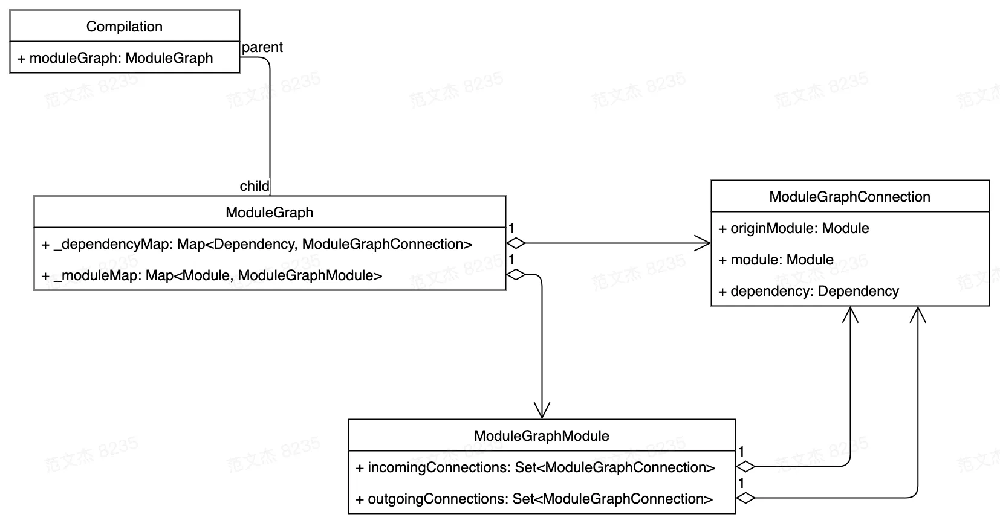
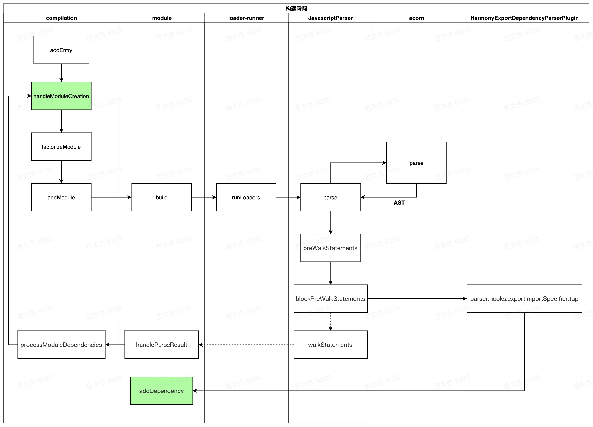
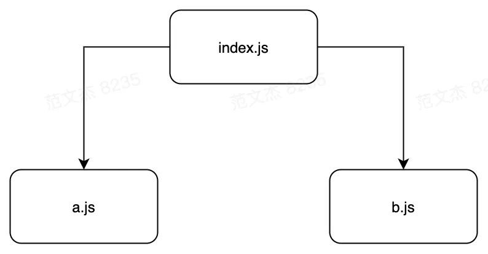

---
title: 有点难的 webpack 知识点：Dependency Graph 深度解析
--- 
# 有点难的 webpack 知识点：Dependency Graph 深度解析

> 全文 2500 字，阅读时长约 30 分钟。如果觉得文章有用，欢迎点赞关注，但写作实属不易，未经作者同意，禁止任何形式转载！！！

## 背景

Dependency Graph 概念来自官网 [Dependency Graph | webpack](https://webpack.js.org/concepts/dependency-graph/) 一文，原文解释是这样的：

> Any time one file depends on another, webpack treats this as a _dependency_. This allows webpack to take non-code assets, such as images or web fonts, and also provide them as _dependencies_ for your application.
>
> When webpack processes your application, it starts from a list of modules defined on the command line or in its configuration file. Starting from these _[entry points](https://webpack.js.org/concepts/entry-points/)_, webpack recursively builds a _dependency graph_ that includes every module your application needs, then bundles all of those modules into a small number of _bundles_ - often, just one - to be loaded by the browser.

翻译过来核心意思是：webpack 处理应用代码时，会从开发者提供的 entry 开始递归地组建起包含所有模块的 _**dependency graph**_ _，_之后再将这些 module 打包为 bundles 。

然而事实远不止官网描述的这么简单，Dependency Graph 贯穿 webpack 整个运行周期，从 make 阶段的模块解析，到 seal 阶段的 chunk 生成，以及 tree-shaking 功能都高度依赖于Dependency Graph ，是 webpack 资源构建的一个非常核心的数据结构。

本文将围绕 webpack\@v5.x 的 Dependency Graph 实现，展开讨论三个方面的内容：

- Dependency Graph 在 webpack 实现中以何种数据结构呈现

- Webpack 运行过程中如何收集模块间依赖关系，进而构建出 Dependency Graph

- Dependency Graph 构建完毕后，又是如何被消费的

学习本文，您将进一步了解 webpack 模块解析的处理细节，结合前文 [\[万字总结\] 一文吃透 Webpack 核心原理](https://zhuanlan.zhihu.com/p/363928061) ，您可以更透彻地了解 webpack 的核心机制。

## Dependency Graph

本节将深入 webpack 源码，解读 Dependency Graph 的内在数据结构及依赖关系收集过程。在正式展开之前，有必要回顾几个 webpack 重要的概念：

- `Module`：资源在 webpack 内部的映射对象，包含了资源的路径、上下文、依赖、内容等信息

- `Dependency` ：在模块中引用其它模块，例如 `import "a.js"` 语句，webpack 会先将引用关系表述为 Dependency 子类并关联 module 对象，等到当前 module 内容都解析完毕之后，启动下次循环开始将 Dependency 对象转换为适当的 Module 子类。

- `Chunk` ：用于组织输出结构的对象，webpack 分析完所有模块资源的内容，构建出完整的 Dependency Graph 之后，会根据用户配置及 Dependency Graph 内容构建出一个或多个 chunk 实例，每个 chunk 与最终输出的文件大致上是一一对应的。

### 数据结构

Webpack 4.x 的 Dependency Graph 实现较简单，主要由 Dependence/Module 内置的系列属性记录引用、被引用关系。

而 Webpack 5.0 之后则实现了一套相对复杂的类结构记录模块间依赖关系，将模块依赖相关的逻辑从 Dependence/Module 解耦为一套独立的类型结构，主要类型有：

- `ModuleGraph` ：记录 Dependency Graph 信息的容器，一方面保存了构建过程中涉及到的所有 `module` 、`dependency` 对象，以及这些对象互相之间的引用；另一方面提供了各种工具方法，方便使用者迅速读取出 `module` 或 `dependency` 附加的信息

- `ModuleGraphConnection` ：记录模块间引用关系的数据结构，内部通过 `originModule` 属性记录引用关系中的父模块，通过 `module` 属性记录子模块。此外还提供了一系列函数工具用于判断对应的引用关系的有效性

- `ModuleGraphModule` ：`Module` 对象在 Dependency Graph 体系下的补充信息，包含模块对象的 `incomingConnections` —— 指向模块本身的 ModuleGraphConnection 集合，即谁引用了模块自己；`outgoingConnections` —— 该模块对外的依赖，即该模块引用了其他那些模块。

类间关系大致为：



上面类图需要额外注意：

- `ModuleGraph` 对象通过 `_dependencyMap` 属性记录 `Dependency` 对象与 `ModuleGraphConnection` 连接对象之间的映射关系，后续的处理中可以基于这层映射迅速找到 `Dependency` 实例对应的引用与被引用者

- `ModuleGraph` 对象通过 `_moduleMap` 在 `module` 基础上附加 `ModuleGraphModule` 信息，而 `ModuleGraphModule` 最大的作用就是记录了模块的引用与被引用关系，后续的处理可以基于该属性找到 `module` 实例的所有依赖与被依赖关系

### 依赖收集过程

`ModuleGraph`、`ModuleGraphConnection`、`ModuleGraphModule` 三者协作，在 webpack 构建过程\(make 阶段\)中逐步收集模块间的依赖关系，回顾前文 [\[万字总结\] 一文吃透 Webpack 核心原理](/webpack/1-how-webpack-works/) 提及的构建流程图：



构建流程本身很复杂，建议读者对比阅读 [\[万字总结\] 一文吃透 Webpack 核心原理](/webpack/1-how-webpack-works/) 一文，加深理解。依赖关系收集过程主要发生在两个节点：

- `addDependency` ：webpack 从模块内容中解析出引用关系后，创建适当的 `Dependency` 子类并调用该方法记录到 `module` 实例

- `handleModuleCreation` ：模块解析完毕后，webpack 遍历父模块的依赖集合，调用该方法创建 `Dependency` 对应的子模块对象，之后调用 `compilation.moduleGraph.setResolvedModule` 方法将父子引用信息记录到 `moduleGraph` 对象上

`setResolvedModule` 方法的逻辑大致为：

``` javascript
class ModuleGraph {
    constructor() {
        /** @type {Map<Dependency, ModuleGraphConnection>} */
        this._dependencyMap = new Map();
        /** @type {Map<Module, ModuleGraphModule>} */
        this._moduleMap = new Map();
    }

    /**
     * @param {Module} originModule the referencing module
     * @param {Dependency} dependency the referencing dependency
     * @param {Module} module the referenced module
     * @returns {void}
     */
    setResolvedModule(originModule, dependency, module) {
        const connection = new ModuleGraphConnection(
            originModule,
            dependency,
            module,
            undefined,
            dependency.weak,
            dependency.getCondition(this)
        );
        this._dependencyMap.set(dependency, connection);
        const connections = this._getModuleGraphModule(module).incomingConnections;
        connections.add(connection);
        const mgm = this._getModuleGraphModule(originModule);
        if (mgm.outgoingConnections === undefined) {
            mgm.outgoingConnections = new Set();
        }
        mgm.outgoingConnections.add(connection);
    }
}
```

上例代码主要更改了 `_dependencyMap` 及 `moduleGraphModule` 的出入 `connections` 属性，以此收集当前模块的上下游依赖关系。

### 实例解析

看个简单例子，对于下面的依赖关系：



Webpack 启动后，在构建阶段递归调用 `compilation.handleModuleCreation` 函数，逐步补齐 Dependency Graph 结构，最终可能生成如下数据结果：

``` javascript

ModuleGraph: {
    _dependencyMap: Map(3){
        { 
            EntryDependency{request: "./src/index.js"} => ModuleGraphConnection{
                module: NormalModule{request: "./src/index.js"}, 
                // 入口模块没有引用者，故设置为 null
                originModule: null
            } 
        },
        { 
            HarmonyImportSideEffectDependency{request: "./src/a.js"} => ModuleGraphConnection{
                module: NormalModule{request: "./src/a.js"}, 
                originModule: NormalModule{request: "./src/index.js"}
            } 
        },
        { 
            HarmonyImportSideEffectDependency{request: "./src/a.js"} => ModuleGraphConnection{
                module: NormalModule{request: "./src/b.js"}, 
                originModule: NormalModule{request: "./src/index.js"}
            } 
        }
    },

    _moduleMap: Map(3){
        NormalModule{request: "./src/index.js"} => ModuleGraphModule{
            incomingConnections: Set(1) [
                // entry 模块，对应 originModule 为null
                ModuleGraphConnection{ module: NormalModule{request: "./src/index.js"}, originModule:null }
            ],
            outgoingConnections: Set(2) [
                // 从 index 指向 a 模块
                ModuleGraphConnection{ module: NormalModule{request: "./src/a.js"}, originModule: NormalModule{request: "./src/index.js"} },
                // 从 index 指向 b 模块
                ModuleGraphConnection{ module: NormalModule{request: "./src/b.js"}, originModule: NormalModule{request: "./src/index.js"} }
            ]
        },
        NormalModule{request: "./src/a.js"} => ModuleGraphModule{
            incomingConnections: Set(1) [
                ModuleGraphConnection{ module: NormalModule{request: "./src/a.js"}, originModule: NormalModule{request: "./src/index.js"} }
            ],
            // a 模块没有其他依赖，故 outgoingConnections 属性值为 undefined
            outgoingConnections: undefined
        },
        NormalModule{request: "./src/b.js"} => ModuleGraphModule{
            incomingConnections: Set(1) [
                ModuleGraphConnection{ module: NormalModule{request: "./src/b.js"}, originModule: NormalModule{request: "./src/index.js"} }
            ],
            // b 模块没有其他依赖，故 outgoingConnections 属性值为 undefined
            outgoingConnections: undefined
        }
    }
}
```

从上面的 Dependency Graph 可以看出，本质上 `ModuleGraph._moduleMap` 已经形成了一个有向无环图结构，其中字典 `_moduleMap` 的 key 为图的节点，对应 value `ModuleGraphModule` 结构中的 `outgoingConnections` 属性为图的边，则上例中从起点 `index.js` 出发沿 `outgoingConnections` 向前可遍历出图的所有顶点。

## 作用

以 webpack\@v5.16.0 为例，关键字 `moduleGraph` 出现了 1277 次，几乎覆盖了 `webpack/lib` 文件夹下的所有文件，其作用可见一斑。虽然出现的频率很高，但总的来说可以看出有两个主要作用：信息索引、转变为 `ChunkGraph` 以确定输出结构。

### 信息索引

`ModuleGraph` 类型提供了很多实现 module / dependency 信息查询的工具函数，例如：

- `getModule(dep: Dependency)` ：根据 dep 查找对应的 `module` 实例
- `getOutgoingConnections(module: Module)` ：查找 `module` 实例的所有依赖
- `getIssuer(module: Module)` ：查找 `module` 在何处被引用\(关于 issuer 机制的更多信息，可参考我的另一篇文章： [十分钟精进 Webpack：module.issuer 属性详解](/webpack/3-module-issuer/) \)

等等。

Webpack\@v5.x 内部的许多插件、Dependency 子类、Module 子类的实现都需要用到这些工具函数查找特定模块、依赖的信息，例如：

- `SplitChunksPlugin` 在优化 chunks 处理中，需要使用 `moduleGraph.getExportsInfo` 查询各个模块的 `exportsInfo` \(模块导出的信息集合，与 tree-shaking 强相关，后续会单出一篇文章讲解\)信息以确定如何分离 `chunk`。
- 在 `compilation.seal` 函数中，需要遍历 entry 对应的 dep 并调用 `moduleGraph.getModule` 获取完整的 module 定义
- ...

那么，在您编写插件时，可以考虑适度参考 `webpack/lib/ModuleGraph.js` 中提供的方法，确认可以获取使用那些函数获取到您所需要的信息。

### 构建 ChunkGraph

Webpack 主体流程中，make 构建阶段结束之后会进入 `seal` 阶段，开始梳理以何种方式组织输出内容。在 webpack\@v4.x 时，`seal` 阶段主要围绕 `Chunk` 及 `ChunkGroup` 两个类型展开，而到了 5.0 之后，与 Dependency Graph 类似也引入了一套全新的基于 `ChunkGraph` 的图结构实现资源生成算法。

在 compilation.seal 函数中，首先根据默认规则 —— 每个 entry 对应组织为一个 chunk ，之后调用 `webpack/lib/buildChunkGraph.js` 文件定义的 `buildChunkGraph` 方法，遍历 `make` 阶段生成的 `moduleGraph` 对象从而将 module 依赖关系转化为 `chunkGraph` 对象。

这一块的逻辑也特别复杂，不在这里展开，下次会单独出一篇文章讲解 `chunk/chunkGroup/chunkGraph` 等对象构筑成的模块输出规则。

## 总结

本文讨论的 Dependency Graph 概念在 webpack 内部被大量使用，因此理解这个概念对我们理解 webpack 源码，或者学习如何编写插件、loader 都会有极大的帮助。在分析过程其实也挖掘出了很多新的知识盲点：

- Chunk 的完整机制是怎么样的？
- Dependency 的完整体系是如何实现的，有何作用？
- Module 的 exportsInfo 如何收集？在 tree-shaking 过程中如何被使用？

如果你也对上述问题感兴趣，欢迎点赞关注，后续会围绕 webpack 输出更多有用的文章。
